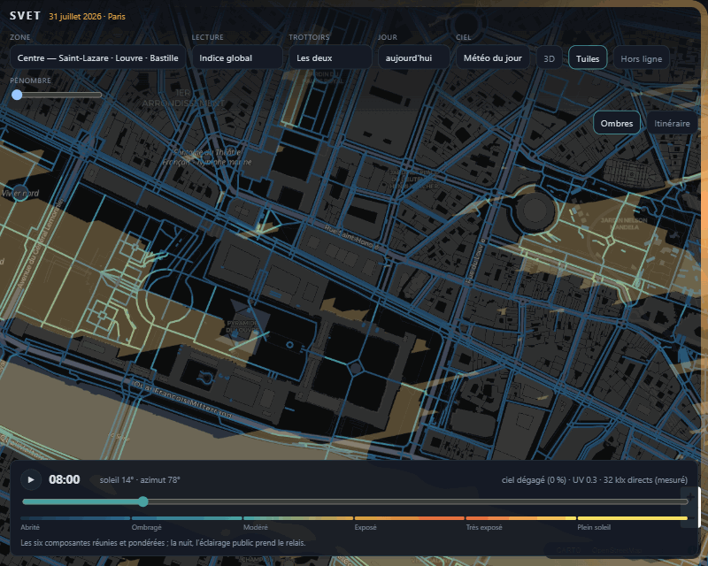
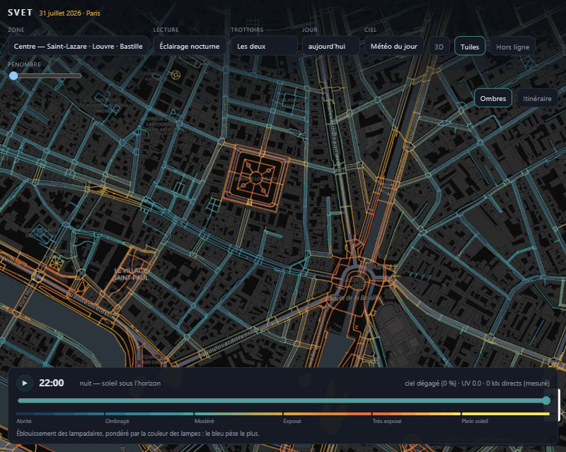

# SVET



*Chaque trottoir est coloré par son exposition, du bleu « abrité » au jaune
« plein soleil », et se recolore d'heure en heure à mesure que les ombres
tournent. Puis le même trajet est calculé deux fois : le plus rapide — 29 min,
indice 38, 35 % au soleil — et le moins exposé — 34 min, indice 21, 10 % au
soleil. Cinq minutes de plus, seize points d'exposition en moins. Rien n'est mis
en scène : ce sont les chiffres qu'affichait l'application avant le passage à
l'éclairement à l'œil (octobre 2026) — les chiffres actuels sont plus bas dans
cette page, à « Résultat mesuré ».*

[](https://github.com/kovarci/svet/actions/workflows/ci.yml)

Carte de l'exposition lumineuse de Paris, et calcul d'itinéraire, pour les
personnes photosensibles.

Pour qui la lumière déclenche douleurs ou migraines, deux itinéraires de même
longueur ne se valent pas du tout : l'un longe un quai plein sud sans un arbre,
l'autre passe par des ruelles à l'ombre. SVET calcule, rue par rue, **trottoir
par trottoir** et minute par minute, à quel point on y est exposé — puis trace
le chemin qui évite la lumière.

---

## Démarrage

```bash
npm install
```

Calculer une zone (télécharge les données ouvertes, puis simule la journée) :

```bash
npm run data
```

Lancer la carte :

```bash
npm run dev
```

Puis ouvrir http://localhost:5178.

Le premier calcul télécharge les données ouvertes et les met en cache dans
`pipeline/cache/`. Les calculs suivants repartent du cache.

Les tests ne demandent ni réseau ni données calculées :

```bash
npm test
```

Ils vérifient ce qui doit tenir quoi qu'il arrive — l'astronomie contre des
éphémérides publiées, les bornes et monotonies de l'indice, la physique contre
ses implémentations de référence (ciel clair, partage direct/diffus et spectre
contre les valeurs de pvlib, efficacités contre les coefficients de `gendaylit`),
et surtout l'**aller-retour binaire** : ce qu'on écrit est-il ce qu'on relit. C'est ce
dernier qui manquait le plus. Le format a changé quatre fois, et un décalage
d'un octet ne plante pas : il décale toutes les séries, et l'application affiche
des couleurs plausibles et fausses.

Le même argument vaut pour le **navigateur**, qui n'avait rien : un itinéraire
faux ne plante pas non plus, il propose un trajet un peu moins bon, et personne
ne le remarque jamais. Un guidage faux annonce une distance qui remonte ou un
trottoir qu'on vient de quitter — au moment précis où l'on marche sans regarder
l'écran, c'est-à-dire où l'on a le moins de moyens de vérifier. Ce qui est
éprouvé, et pourquoi :

| | Ce qui casserait en silence |
|---|---|
| `routing.js` | la pondération qui ne change plus rien, l'heure de passage qui n'avance pas, un réseau exposé qui devient infranchissable |
| `navigation.js` | le recalage qui saute sur le brin d'en face, le bruit GPS qui fait reculer la progression, le trottoir qui alterne à chaque tronçon |
| `cells.js` | la couture des graphes régionaux, sans laquelle le réseau est coupé à chaque bord de cellule |
| `link.js` | un lien d'itinéraire qui ne rend pas ce qu'on y a mis |
| `offline.js` | un pavage décalé, et l'on prépare le quartier d'à côté |

Aucun n'a besoin de réseau, de navigateur ni de données calculées : les graphes
sont dessinés à la main, les cellules sont fausses, les positions sont posées.
Le premier défaut trouvé par ces tests était réel — un lien sans priorité
poussait le curseur sur « le plus rapide » à chaque ouverture, ce qui vidait
l'application de son objet.

Deux autres commandes, du même ordre :

```bash
npm run lint      # eslint : les fautes qu'une relecture ne voit pas
npm run format    # prettier : la mise en forme, une fois pour toutes
```

Le linter ne juge pas le style — c'est Prettier qui s'en charge, et
`eslint-config-prettier` éteint tout ce qui pourrait les faire se disputer
l'indentation. Il attrape ce qu'une relecture rate : une variable jamais lue,
une promesse jamais attendue, un `case` qui déborde sur le suivant.

### Zones

```bash
node pipeline/src/build.js --zone=test      # Île de la Cité, 2 s
node pipeline/src/build.js --zone=marais    # Marais / Bastille, 11 s
node pipeline/src/build.js --zone=centre    # Saint-Lazare → Louvre → Bastille, 14 s
node pipeline/src/build.js --zone=paris     # Paris intra-muros, 2 min
node pipeline/src/build.js --date=2026-12-21   # au solstice d'hiver
node pipeline/src/build.js --step=15           # pas de temps plus fin
```

Ces durées supposent le cache de téléchargement chaud ; le premier calcul y
ajoute quelques minutes. Chaque exécution affiche le temps par étape — sur
Paris : 43 % en simulation solaire, 29 % en facteur de vue du ciel, 12 %
d'empaquetage, le reste en modèle de surface et découpage.

Départ et arrivée doivent tenir dans la même emprise. `paris` couvre
l'intra-muros : 128 174 emprises bâties, 190 509 arbres, 224 385 tronçons, un
graphe de 399 973 nœuds et 453 459 arêtes. Sacré-Cœur → Bastille s'y calcule en
0,4 s. Les zones sont définies dans
[`pipeline/src/config.js`](pipeline/src/config.js).

Quand seule la mise en forme change — découpage des tuiles, métadonnées — il est
inutile de refaire les lancers de rayons :

```bash
npm run repack --workspace pipeline
```

La pyramide se reconstruit depuis les fichiers déjà écrits, et l'horodatage des
zones est renouvelé pour que rien d'ancien ne traîne en cache.

### L'Île-de-France entière

Une zone se calcule d'un bloc et se charge d'un fichier. Paris intra-muros fait
105 km² et pèse déjà 54 Mo de binaire. **La région en fait 12 000** — cent
quinze fois plus. Il n'y a pas de réglage qui rende ça tenable d'un bloc : le
modèle de surface seul dépasserait les trois milliards de cellules.

La région se calcule donc **par cellules**, chacune indépendante :

```bash
npm run data:region                          # les 343 cellules d'Île-de-France
npm run data:region -- --jobs=3              # trois calculs de front
npm run data:region -- --only=12-2074-1409   # une cellule précise
npm run data:region -- --index-only          # réassemble sans recalculer
```

Chaque cellule tourne dans son propre processus — la mémoire est rendue entre
deux, et une commune dont le serveur bégaie ne fait pas tomber la région. Un
manifeste note ce qui est fait : **relancer reprend où l'on s'était arrêté**, ce
qui n'est pas un luxe sur un calcul de cette durée.

#### Le découpage est calé sur la grille de tuiles

Les cellules sont les tuiles du zoom 12 — environ 6,4 × 6,4 km, soit 41 km². Ce
calage n'est pas cosmétique : il garantit qu'**une tuile appartient à exactement
une cellule**. Toutes écrivent donc dans la même pyramide sans se marcher
dessus, et sans passe de fusion des tuiles de bordure. Sous le zoom 12, une
tuile déborde de sa cellule : ces zooms-là sont construits en une passe finale,
depuis les axes structurants de chaque cellule.

Les identifiants suivent le même principe : le rang de la cellule occupe les
bits de poids fort. Retrouver le fichier qui décrit un tronçon est un décalage,
pas une recherche.

#### Ce que ça coûte

Construction complète mesurée sur cette machine, cache froid, `--jobs=6` :

| | |
|---|---|
| durée | **5 h** (343 cellules, 0,85 min/cellule) |
| sortie | **2,7 Go** — 406 Mo de binaires, le reste en tuiles |
| tronçons | **2 114 164** |
| tuiles | 118 643 |
| échecs | 3, tous repris à la relance |

**Le calcul n'est pas le goulot, et de loin.** Mesuré pendant la construction :
0,5 % de processeur sur douze cœurs, et 15,9 Mbit/s sur un lien qui en annonce
866. Tout le temps passe à attendre la Géoplateforme. C'est pourquoi les dalles
d'un raster sont demandées par quatre et non une par une, et pourquoi `--jobs`
compte plus que la puissance de la machine — un GPU n'y changerait rien, le
lancer de rayons ne pèse que 3 à 5 % d'une cellule.

Le cache de rasters est borné (3 Go par défaut, `--cache-go=`) : sans cela, les
seules dalles LiDAR en occuperaient vingt-deux, et le disque se remplirait au
milieu de la nuit.

#### Hors de Paris, les sources changent

Trois des cinq jeux s'arrêtent au périphérique. Ce qui les remplace :

| donnée | à Paris | en région |
|---|---|---|
| bâti | APUR (128 175 emprises, hauteurs photogrammétriques) | IGN BD TOPO® |
| végétation | 219 418 arbres recensés, essence connue | BD TOPO, zones de végétation |
| éclairage | 165 600 points, flux et température de couleur | lampadaires OSM, sous condition |
| chantiers | jeu quotidien de la Ville | **rien** |
| relief et surfaces | LiDAR HD | LiDAR HD **là où il a volé** |

Deux de ces lignes demandent d'être regardées de près.

**Le LiDAR ne couvre pas la région.** Mesuré sur les 343 cellules :
**58 % de couverture moyenne**, et la répartition dit mieux que la moyenne
pourquoi le sujet est délicat —

| | cellules | |
|---|---|---|
| LiDAR seul | 149 | 43 % |
| LiDAR **et** comblement vectoriel | 71 | 21 % |
| vectoriel seul | 123 | 36 % |

Le relevé s'arrête à l'ouest du Hurepoix et laisse une bande vide vers
Coulommiers. Et le service ne dit pas non : il répond une dalle pleine et
régulière, remplie de −9999. Prise pour argent comptant, elle donnait une plaine
parfaitement plate, sans un bâtiment, et un ensoleillement maximal partout.
C'est le pire mode de défaillance possible ici — une réponse plausible et fausse.

Le pipeline détecte donc l'absence et **comble cellule de grille par cellule de
grille** avec le bâti extrudé. Ce sont les 71 cellules de la ligne du milieu qui
justifient ce choix : à cheval sur une lisière de livraison, elles auraient
porté une couture visible en plein milieu du territoire si l'on avait basculé
d'un modèle à l'autre par emprise entière.

Une cellule est sondée à 64 pixels de côté avant d'être téléchargée en pleine
résolution : sans ce coup de sonde, une cellule non couverte coûtait 110 Mo et
une minute quarante pour recevoir des −9999. Sur 123 cellules, c'était trois
heures de téléchargement pour rien.

**L'éclairage n'existe pas à l'échelle régionale.** Ni le catalogue de la Région,
ni data.gouv.fr ne publient d'équivalent : pour l'éclairage public, on n'y trouve
que Paris, et des villes hors région. Reste OpenStreetMap, seule source uniforme
— mais **33 246 lampadaires dans Paris contre 165 600 dans le jeu de la Ville**,
soit un cinquième. S'en servir tel quel donnerait une région quatre fois trop
sombre, et « rue sombre » est exactement la recommandation qu'il ne faut pas
fausser. Le relevé OSM n'est donc retenu que là où sa densité montre que le
secteur a vraiment été cartographié — quarante lampadaires au kilomètre de voie,
moins de la moitié de la densité parisienne. En dessous, l'application affiche
« non renseigné », ce qu'elle sait déjà faire.

Les chantiers, eux, restent parisiens : il n'existe rien d'autre, sinon les
travaux départementaux des Hauts-de-Seine, qui ne portent que sur la voirie du
département.

#### Servir une région : le 404 n'est pas optionnel

Un hébergeur de page unique répond `index.html` avec un code 200 pour tout
chemin inconnu. Sur une zone, le pipeline contournait ça en écrivant une tuile
vide pour chaque case de l'emprise. Une région en demanderait des centaines de
milliers — et surtout **elle a de vrais trous** : les coins de l'emprise
englobante tombent hors du territoire, et une construction s'étale sur des
heures pendant lesquelles la moitié des cellules n'existe pas.

Le serveur doit donc répondre **404 pour tout fichier absent sous `/data/`**.
C'est fait pour le serveur de développement
([`web/vite.config.js`](web/vite.config.js)) ; en production, c'est une règle de
réécriture à exclure, pas du code. Sans elle, le journal se remplit de
« Unimplemented type: 4 » et les tuiles sont perdues.

Le même fichier retire `public/data` au guetteur de Vite. Ce n'est pas un
réglage de confort : confier 118 643 tuiles au guetteur lui coûte assez
d'entrées-sorties pour que **servir 1,4 Ko de `zones.json` prenne treize
secondes**. L'application reste alors bloquée sur « Chargement des données… »
sans que rien dans la console ne l'explique.

---

## Ce qui existe déjà, et ce qu'on a repris

L'ombre urbaine est un sujet bien défriché. Le travail utile ici n'était pas de
réinventer le calcul d'ombre, mais de trouver **les bonnes données pour Paris**
et de définir un indice qui parle de photosensibilité plutôt que de chaleur.

| Outil | Ce qu'il fait | Pourquoi on ne l'a pas pris tel quel |
|---|---|---|
| [ShadeMap](https://shademap.app) / [leaflet-shadow-simulator](https://github.com/ted-piotrowski/leaflet-shadow-simulator) | Ombres en direct dans une carte Leaflet/MapLibre, très abouti | Service propriétaire à clé d'API, ombres visuelles seulement : aucune valeur exploitable par tronçon, donc rien pour calculer un itinéraire |
| [UMEP / SOLWEIG](https://umep-docs.readthedocs.io/) | Référence académique : ombres, facteur de vue du ciel, confort thermique | Conçu pour le confort *thermique*, pas pour la gêne lumineuse. Chaîne QGIS lourde pour une appli web |
| [shadow-mapper](https://github.com/perliedman/shadow-mapper) | Cartes d'ombre depuis OSM, en Python | Hauteurs OSM uniquement, sans arbres |
| [ShadeRoute](https://dl.acm.org/doi/10.1145/3748777.3748797) / [CoolWalks](https://arxiv.org/pdf/2405.01225) | Itinéraires à l'ombre, sur GraphHopper | Optimisent la fraîcheur, pas la gêne lumineuse ; et une JVM pour 90 000 arêtes est disproportionnée |

**Repris** : les méthodes publiées et éprouvées — balayage d'horizon pour le
facteur de vue du ciel (Ratti & Richens), coordonnées solaires de
l'*Astronomical Almanac*, atténuation du feuillage par Beer-Lambert,
nébulosité par Kasten & Czeplak ; ciel clair d'Ineichen & Perez, partage d'Erbs,
efficacités lumineuses et ciel « toutes conditions » de Perez, spectre SPCTRL2 de
Bird & Riordan, fonctions α-opiques de la CIE S 026, structure de la *Daylight
Glare Probability* de Wienold & Christoffersen, indices de position de Guth et
d'Iwata. Chaque maillon est éprouvé contre son implémentation de référence —
pvlib, `gendaylit` et `evalglare` (Radiance).

**Repris de la recherche clinique** : ce qui déclenche la photophobie — cônes et
mélanopsine réunis (Zele et al. 2021 ; McAdams et al. 2020 ; Noseda et al.
2016) —, la croissance logarithmique de la gêne (McAdams et al.), et le seuil
d'inconfort mesuré chez les personnes migraineuses (Perenboom et al. 2018).

**Écrit ici** : l'assemblage Paris, l'indice de gêne lumineuse, et le calcul
d'itinéraire pondéré par cet indice.

### Aucun appareil de mesure n'est nécessaire

**Rien ici ne se mesure sur le terrain.** La position du soleil est un calcul
d'astronomie. Les ombres sont de la géométrie sur des hauteurs de bâtiments et
un relief déjà relevés par photogrammétrie. L'éclairement par ciel clair est un
modèle physique standard. Un luxmètre servirait à *valider* le modèle, pas à le
construire.

---

## Données

Tout est ouvert, gratuit, sans compte ni clé d'API.

| Donnée | Source | Contenu |
|---|---|---|
| Emprises bâties et hauteurs | [APUR](https://opendata.apur.org/datasets/emprise-batie-paris) — `EMPRISE_BATIE_PARIS` | 128 175 emprises, hauteurs **mesurées** par photogrammétrie |
| Surfaces et relief | [IGN LiDAR HD®](https://geoservices.ign.fr/lidarhd) via WMS | Toitures et houppiers réels, relevés au laser. Lu directement en flottants 32 bits |
| Relief (repli) | [IGN RGE ALTI®](https://geoservices.ign.fr/rgealti) via WMS | Terrain nu, pour le mode vectoriel |
| Arbres | [Ville de Paris](https://opendata.paris.fr/explore/dataset/les-arbres/) — `les-arbres` | 219 418 arbres : hauteur, circonférence, genre |
| Réseau piéton et traversées | [OpenStreetMap](https://www.openstreetmap.org) via Overpass | Trottoirs, rues, passages, escaliers, passages cloutés |
| Photos aériennes | [IGN BD ORTHO®](https://geoservices.ign.fr/bdortho) + graphe de mosaïquage | 20 cm sur Paris, avec la date de vol — sert à valider les ombres |
| Flux, nébulosité, point de rosée, UV | [Open-Meteo](https://open-meteo.com) | Prévision horaire (modèle AROME de Météo-France) |
| Adresses et lieux | [Nominatim](https://nominatim.openstreetmap.org) | Gares, musées, adresses |
| Fond de carte | [CARTO](https://carto.com/basemaps) *dark matter* | — |

Licences : ODbL, Licence ouverte pour l'IGN. Attribution obligatoire.

Le choix d'APUR plutôt qu'OSM pour les hauteurs est déterminant : à Paris, OSM
porte surtout `building:levels`, dont on déduirait une hauteur en multipliant par
3 m — approximation grossière face à des toits mansardés très variés. APUR donne
la mesure.

---

## Comment l'indice est calculé

### 1. Modèle numérique de surface — le LiDAR HD

La géométrie vient du **LiDAR HD de l'IGN** : toitures réelles avec leurs
mansardes, houppiers réels, murs, kiosques. Tout ce qui est physiquement là,
relevé au laser, plutôt que des emprises extrudées à plat et des arbres devinés
par allométrie.

Toutes les hauteurs manipulées sont des **altitudes absolues**, pas des hauteurs
au-dessus du sol. C'est ce qui permet à un rayon rasant de buter sur une colline
comme il bute sur un immeuble — la butte Montmartre est un obstacle comme un
autre.

Bâti et végétation restent **séparés**, délibérément : l'ombre d'un immeuble est
nette et stable, celle d'un arbre est tamisée et clignotante quand on marche
dessous. Pour une personne photosensible, ce n'est pas la même chose du tout.

Or **le LiDAR donne la forme, jamais la nature** : le modèle de surface ne dit
pas si ce qui dépasse est un mur ou un feuillage. On croise donc trois sources —
le LiDAR pour la géométrie, les emprises APUR pour dire où est le bâti, le
fichier des arbres pour caractériser le feuillage (persistant ou caduc).

Un piège s'y cache. L'emprise APUR décrit le bâtiment **au sol** ; le LiDAR voit
la **corniche**, qui déborde de 0,5 à 1,5 m sur les toits parisiens. Sans marge,
tout le pourtour de chaque immeuble ressort comme un obstacle non bâti — donc
classé en végétation, donc rendu translucide. Mesuré sur le Marais :

| Marge de corniche | Pixels hauts hors bâti | dont sous un arbre recensé | inexpliqués |
|---|---|---|---|
| 0 m | 61 637 | 20 % | 49 541 |
| **2 m** | 28 707 | 39 % | **17 393** |
| 4 m | 20 366 | 48 % | 10 667 |

Deux mètres éliminent 33 000 des 49 500 pixels aberrants tout en conservant 94 %
des pixels d'arbres recensés ; au-delà on commence à manger de la vraie
végétation. Ce qui reste inexpliqué — arbres de cour privée absents du fichier
municipal, kiosques, murets — est tenu pour de la végétation. C'est le pari le
plus sûr : rendre un mur translucide fait **surestimer** l'exposition, alors que
rendre un arbre opaque ferait croire à un abri qui n'existe pas.

Le mode `vector` (emprises extrudées, arbres en dômes) reste disponible dans
[`config.js`](pipeline/src/config.js) : il ne dépend que de données légères,
sert de repli là où le LiDAR n'a pas volé, et de point de comparaison.

### 2. Occultation solaire, trottoir par trottoir

En chaque point d'échantillonnage du réseau piéton (à 1,60 m du sol), un rayon
est lancé vers le soleil. Il renvoie une transmission : 1 en plein soleil, 0
derrière un obstacle opaque, une valeur intermédiaire sous un feuillage.

La hauteur du soleil fait tout : à 59° (14 h en juillet) un immeuble de 20 m
projette 12 m d'ombre, à 23° (19 h) il en projette 47.

**Les deux trottoirs sont traités séparément.** À Paris, OpenStreetMap ne
cartographie presque jamais les côtés d'une rue distinctement : une rue est un
seul trait. Or le trottoir nord et le trottoir sud, ce n'est souvent pas la même
journée. Les points sont donc déportés de part et d'autre de l'axe.

**La largeur de chaussée est mesurée**, pas devinée : depuis l'axe, un rayon
part perpendiculairement de chaque côté jusqu'à buter sur une façade, et le
piéton est placé 2 m en retrait — le milieu d'un trottoir parisien courant. On
prend la **médiane** des relevés du tronçon : une rue transversale ouvre une
brèche dans l'alignement, et le rayon file alors jusqu'à un immeuble lointain.

Le déport ne s'applique qu'aux **axes de chaussée**. Un trottoir cartographié,
une piste cyclable ou une rue piétonne sont déjà à leur position réelle : les
déporter serait un contresens.

### 3. Facteur de vue du ciel

Balayage de l'horizon sur 32 azimuts, jusqu'à 150 m. Pour un horizon d'élévation
β, la fraction de ciel visible vaut cos²β ; on moyenne sur les azimuts. Une
ruelle du Marais tombe vers 0,25, un pont sur la Seine dépasse 0,85.

C'est une grandeur purement **géométrique** : elle dit quelle *part* de voûte on
voit, pas ce qu'elle vaut en luminance. Longtemps le modèle s'en contentait,
posant `diffus = svf × éclairement diffus` — c'est-à-dire un ciel de luminance
uniforme. Ce n'est jamais le cas, et l'erreur n'est pas petite.

### 3 bis. Le ciel n'est pas uniforme — modèle de Perez

Sous un ciel **couvert**, le zénith vaut environ trois fois l'horizon (Moon &
Spencer). Une ruelle ne voit qu'une bande de ciel autour du zénith : la partie la
plus lumineuse. Le facteur de vue du ciel la **sous-estime**.

Sous un ciel **clair**, c'est pire : la luminance culmine autour du soleil et
remonte vers l'horizon. Deux rues de même facteur de vue du ciel, l'une ouverte
vers le soleil et l'autre à l'opposé, reçoivent des éclairements diffus très
différents. L'ancien modèle leur donnait la même valeur, à la seconde près.

La luminance d'un élément de ciel suit la forme du ciel général normalisé CIE
(ISO 15469:2004) :

```
L(Z, χ) ∝ [1 + a · exp(b / cos Z)] · [1 + c · exp(d·χ) + e · cos²χ]
```

Ses cinq coefficients viennent du **modèle « toutes conditions » de Perez,
Seals & Michalsky** (*Solar Energy* 50, 1993), qui les calcule depuis les flux
mesurés : clarté ε, luminosité Δ, hauteur du soleil. C'est le modèle de
`gendaylit`, dans Radiance, la référence de la simulation d'éclairage naturel ;
ses coefficients sont recopiés de ce code, avec les deux garde-fous qu'il
applique.

Il remplace un fondu entre huit des quinze types CIE, choisi d'après ε seul. La
luminosité Δ n'y servait pas, alors qu'elle distingue un couvert lumineux d'un
couvert d'orage à ε égal.

On l'intègre sur la portion de ciel **réellement visible**, lue dans le profil
d'horizon de trente-deux secteurs que le pipeline stocke déjà. Deux propriétés en
font un raffinement strict plutôt qu'un remplacement :

- en site dégagé, le facteur vaut **exactement 1** : le niveau annoncé par la
  météo n'est pas déplacé, seule la répartition l'est ;
- pour un ciel de luminance uniforme, l'intégrale redonne **exactement cos²β**,
  c'est-à-dire le facteur de vue du ciel d'avant.

Une seule grille de luminance sert à trois intégrales : le plan horizontal du
piéton, le plan vertical de chaque façade, et le plan vertical de **l'œil** (voir
plus bas).

**Le feuillage était sorti du calcul — c'est réparé.** Le profil d'horizon ne
relève que le bâti ; le feuillage n'est porté que par le facteur de vue du ciel,
calculé par Beer-Lambert. En passant au ciel anisotrope, le modèle avait cessé de
lire ce facteur dès qu'un profil existait. Sous les platanes, le ciel comptait
donc comme dégagé. Mesuré à profil égal : la composante de ciel restait à 0,453
pour un facteur de vue de 0,6, de 0,3 ou de 0,1, et l'éclairement *montait* même
légèrement. La part de ciel qui atteint le piéton est désormais multipliée par
celle que le feuillage laisse passer — le rapport entre le facteur de vue mesuré
et celui du seul bâti.

**Et l'intégration était décalée d'un demi-secteur.** Le profil d'horizon est
relevé par un rayon tiré exactement à l'azimut du secteur ; le ciel était
intégré sur `[s, s+1[` au lieu de `[s−½, s+½[`, soit 5,6° à côté de ce qu'on
prétendait lire.

Lors du passage au ciel anisotrope (alors sur les types CIE), l'écart mesuré sur
la zone « centre », 83 306 relevés de trottoir, était de 1,6 à 1,9 point en
moyenne et jusqu'à 14 points sur le Port du Louvre, ouvert plein sud sur la
Seine.

### 3 ter. Le sol

Une chaussée ensoleillée à 80 000 lux renvoie près de 4 000 cd/m², du même ordre
qu'un mur de calcaire au soleil, et elle occupe **toute la moitié basse du champ
de vision**, celle où l'on regarde en marchant.

Le sol a sa propre réflectance, 0,18 : l'asphalte est autour de 0,10, un trottoir
de pierre entre 0,25 et 0,35 — bien plus sombre que les 0,45 des façades.

Le sol qu'on voit n'est pas celui sur lequel on se tient. La part qui partage
l'ombre du piéton était posée à la moitié ; elle se **dérive**. Pour un regard
horizontal, le sol à la dépression δ pèse cos²δ dans l'éclairement du plan de
l'œil. Le trottoir sous les pieds — jusqu'à 2 m, la distance à laquelle le piéton
est placé de sa façade — est vu au-delà de δ* = atan(1,6 / 2) = 38,7°, et pèse
**26 %**. Le reste est la chaussée devant soi, dont la part ensoleillée se lit
dans la géométrie de canyon.

### 4. La réverbération des façades

Un mur de calcaire lutétien au soleil, avec 50 000 lux dessus et un albédo de
0,45, atteint **7 000 cd/m²** — la luminance d'un ciel couvert lumineux. Sauf que
le mur, lui, est **à hauteur des yeux**. Marcher sur le trottoir à l'ombre face à
un mur en plein soleil peut être plus pénible qu'être au soleil.

**Comment savoir si le mur d'en face est éclairé.** Par la géométrie de canyon,
sur le seul profil d'horizon. Dans une rue de largeur W, le soleil à la hauteur α
passant au-dessus d'un bâtiment de hauteur H₁ projette son ombre jusqu'à
H₁ − W·tan α sur le mur d'en face. En posant β₁ et β₂ les élévations d'horizon
vues du piéton, la part éclairée du mur vaut

```
1 − max(0, tan β₁ − tan α_eff) / tan β₂
```

**La largeur de la rue s'élimine** : il ne reste que des angles, ceux-là mêmes
que le balayage d'horizon a déjà relevés. α_eff corrige l'obliquité : de biais,
le rayon traverse la chaussée sur W/cos Δθ au lieu de W, et descend d'autant plus.

**Les façades regardent la chaussée, pas le piéton.** Le modèle traitait chaque
secteur d'horizon comme un mur tourné vers le piéton. C'est vrai sur une place
circulaire, faux dans une rue : le mur qu'on voit en enfilade est le même plan
que celui d'en face, et sa normale est perpendiculaire à la rue. Conséquence : un
soleil dans l'axe de la rue éclairait de plein fouet des façades qu'il ne fait
que raser. L'orientation réelle se lit dans la **forme** du profil : un mur plan
se voit sous tan β(φ) = (H/W)·cos(φ − θ), et trois secteurs voisins suffisent à
retrouver θ :

```
tan(φ − θ) = (t₋ − t₊) / (t₋ + t₊) · cot δ
```

Sur un canyon plan, la normale est retrouvée à moins de 2° près.

**Le ciel que voit la façade** est intégré sur son plan vertical, avec la même
distribution de luminance, à travers l'obstruction du bâtiment d'en face vu de
son pied — deux fois moins haut en angle que vu du piéton. Sous ciel uniforme et
sans obstruction, l'intégrale redonne exactement le « demi-ciel » de 0,5
qu'employait le modèle.

**Les vitrages.** Une façade n'est pas que de la pierre. On pose un quart de
surface vitrée — l'ordre de grandeur d'un immeuble haussmannien, faute de donnée
ouverte bâtiment par bâtiment. Ce quart ne renvoie presque rien en diffus,
l'intérieur est sombre ; en revanche il renvoie le soleil **en miroir**. Pour un
mur vertical de normale n, l'image du soleil se voit à la même hauteur que lui, à
l'azimut 2n + π − A_s, avec la réflectance de Fresnel d'un simple vitrage. Elle
existe si le soleil éclaire ce mur, si le mur monte assez haut dans cette
direction, et si le point de réflexion est au-dessus de la ligne d'ombre. C'est
le cas du soleil **dans le dos** : on ne le voit pas, on voit son reflet sur la
façade d'en face. L'ancien modèle comptait cette situation par un plancher de 0,3,
posé sans mesure.

**Et la grandeur retenue est une luminance**, multipliée par l'angle solide que
chaque pan de mur occupe dans le champ de l'œil. Les rebonds suivants — la
façade éclairée qui éclaire celle d'en face — suivent la série géométrique
1 / (1 − ρ̄·(1 − ψ)), avec ρ̄ la réflectance moyenne et ψ la part de ciel.

Mesuré avec la version précédente, à 14 h, pour des piétons **tous à l'ombre** —
ces chiffres datent d'avant la normale réelle et les vitrages, ils montrent
l'ordre de grandeur de l'effet :

| Rue | Ouverture au ciel | Murs éclairés | Luminance des murs |
|---|---|---|---|
| Rue des Écouffes | 44 % | 33 % | **4 098 cd/m²** |
| Rue de la Huchette | 30 % | 41 % | 3 960 cd/m² |
| Rue de la Colombe | 19 % | 0 % | **1 017 cd/m²** |
| Avenue Victoria | 37 % | 0 % | 1 017 cd/m² |

### 5. Ce qui arrive dans l'œil — l'indice

L'indice additionnait six composantes : soleil direct, ouverture au ciel,
luminosité, réverbération, éblouissement, scintillement. Deux défauts de fond :

- **elles dépendaient presque toutes du faisceau direct.** Le soleil pesait en
  réalité bien plus que les 0,34 annoncés, et deux jeux de poids plausibles
  pouvaient inverser le classement de deux rues ;
- **elles mesuraient la lumière là où elle ne gêne pas.** La luminosité reposait
  sur l'éclairement *horizontal*, celui d'un plan qui regarde le zénith. Or la
  lumière qui fait mal entre par l'œil, et l'œil regarde devant lui.
  L'horizontal surpondère le soleil de midi et sous-pondère le soleil bas,
  c'est-à-dire l'inverse de ce qui fait mal.

On calcule donc ce qui arrive **à l'œil**, et l'indice n'a plus que trois termes.

#### L'éclairement à l'œil

La CIE S 026 définit l'éclairement mélanopique au niveau de la cornée, dans le
plan vertical, dans la direction du regard. Et l'éclairement vertical à l'œil
est, de toutes les grandeurs étudiées, le meilleur prédicteur de l'inconfort
visuel en lumière naturelle. C'est le premier terme de la *Daylight Glare
Probability* (Wienold & Christoffersen, *Energy and Buildings* 38, 2006, r² =
0,94 sur leurs observateurs), et une analyse récente par apprentissage le
retrouve au premier rang (Luo et al., *Building and Environment*, 2024).

Il se compose de :

- **le soleil**, selon l'angle entre lui et le regard ;
- **le ciel visible devant soi**, intégré sur le plan vertical à travers le
  profil d'horizon et le feuillage ;
- **chaque pan de façade**, sa luminance multipliée par son angle solide
  projeté ;
- **le sol**, qui occupe tout le demi-espace sous la ligne d'horizon ;
- **les reflets du soleil** dans les vitrages et sur la chaussée mouillée.

#### Ce qui déclenche la photophobie : les cônes et la mélanopsine

Le modèle posait que la photophobie passait « pour l'essentiel » par la
mélanopsine, et pondérait tout par elle seule. Les mesures les plus directes
disent autre chose :

- **Zele et al.**, *Cephalalgia* 41 (2021) : seuils de photophobie mesurés par
  électromyographie, en lumière plein champ, sur des lumières étroites qui
  balaient les deux spectres d'action. Le modèle qui rend compte des seuils
  **combine** mélanopsine et luminance des cônes, la mélanopsine pesant environ
  **1,5 fois** plus ;
- **McAdams et al.**, *PNAS* 117 (2020) : les cônes et la mélanopsine se
  combinent de la même façon chez les migraineux et chez les témoins ; ce qui
  diffère est une amplification en aval de la rétine. Et la gêne déclarée croît
  **comme le logarithme** du signal ;
- **Noseda et al.**, *Brain* 139 (2016) : le vert aggrave le moins la céphalée,
  le bleu, l'ambre et le rouge davantage — une composante portée par les cônes,
  que la mélanopsine seule ne prédit pas.

Le signal retenu est donc celui de Zele, la situation la plus proche de la nôtre
(lumière continue, plein champ) :

```
signal = (E_photopique + 1,5 · E_mélanopique) / 2,5
```

Les deux en lux équivalents D65 : pour la lumière du jour standard, le signal
égale l'éclairement.

#### Le spectre, calculé et non posé

Le rapport mélanopique de la lumière du jour reposait sur des températures de
couleur posées à la main — 5 600 K pour le soleil haut, de 6 500 à 16 000 K pour
le ciel selon une « part directionnelle » maison — puis sur une table de phases
D. Ni les températures ni la table n'avaient de source.

On calcule désormais les spectres par **SPCTRL2** (Bird & Riordan, *Journal of
Climate and Applied Meteorology* 25, 1986), le modèle spectral de ciel clair du
NREL, porté depuis `pvlib`, et on les intègre contre les fonctions de la
**CIE S 026:2018**. Les tables viennent de leurs sources par un script
(`pipeline/derive-spectra.mjs`), jamais recopiées à la main. Le portage reproduit
pvlib à 10⁻⁴ près, longueur d'onde par longueur d'onde, et le faisceau direct
AM1.5 tombe à 0,866 contre 0,881 pour la référence ASTM G173.

L'épaisseur optique des aérosols se déduit du trouble de Linke par la formule de
Kasten (Molineaux et al., 1998 ; Ineichen, 2008), inversée. Avec un trouble de 4,
cela donne 0,22 à 500 nm, la moyenne parisienne.

Ce que ça change, à trouble 4 :

| | ancien | calculé |
|---|---|---|
| soleil à 10° | 0,68 | **0,62** |
| soleil à 60° | 0,91 | 0,87 |
| ciel clair | 1,39 à 1,44 | **1,11 à 1,16** |

Le ciel parisien est moins bleu que ne le supposait le modèle : les aérosols
diffusent toutes les couleurs. Sous les nuages, la lumière diffusée par les
gouttelettes est spectralement neutre. La part couverte du ciel reçoit donc le
spectre du global clair, et la part dégagée celui du ciel bleu ; le partage suit
la clarté de Perez.

#### La dose, en logarithme

McAdams et al. le mesurent : la gêne croît linéairement avec le logarithme du
signal, à la manière de la loi de Weber-Fechner. La dose part donc d'un **seuil
mesuré** et monte en logarithme :

```
dose = log(signal / 437 lx) / log(plafond / 437 lx)
```

- **437 lx** (2,64 log lux) est le seuil d'inconfort lumineux de 39 patients
  atteints de migraine épisodique, entre les crises (Perenboom et al., *Pain*
  159, 2018), contre 955 lx chez les témoins. En dessous, rien ne gêne la
  personne médiane du public visé ;
- **le plafond** est ce que le modèle peut produire de pire : en site dégagé, par
  ciel clair, face au soleil. On normalise sur la physique, pas sur une valeur
  choisie.

#### Les sources éblouissantes, à la manière de la DGP

Le second terme de la DGP somme les sources vives :

```
log₁₀(1 + Σ L²·ω / (E_v^1,87 · P²))
```

L, ω et P sont la luminance, l'angle solide et l'indice de position de chaque
source, E_v l'éclairement à l'œil. Pour le disque solaire et ses reflets,
L²·ω = E_n²/ω, avec E_n l'éclairement normal qu'ils apportent.

**L'indice de position** est celui de **Guth** au-dessus de la ligne de regard,
dans l'ajustement de Levin, avec son écart latéral ; et celui d'**Iwata** en
dessous, retenu par la CIE en 2010 : une source basse — le reflet d'une chaussée
mouillée — gêne davantage qu'une source haute à la même distance angulaire.
C'est le code d'`evalglare`, l'outil de référence de Wienold, sauf son plafond à
16. Dans notre champ, l'indice ne dépasse pas 16,4, et ce plafond faisait
remonter l'éblouissement à l'approche du bord. L'ancien modèle n'employait que
la branche verticale et remplaçait l'écart latéral par une rampe en cosinus.

**Le champ visuel** borne les sources : 60° vers le haut, 75° vers le bas, 100°
de côté — les valeurs cliniques de la périmétrie —, avec un bord elliptique entre
les deux. Un soleil à 60° de haut et 90° de côté est au-dessus de la tempe. Avec
des limites rectangulaires, il restait « visible » ; et comme il n'éclaire
presque pas le plan de l'œil, le dénominateur l'aurait rendu plus éblouissant
qu'un soleil de face. Le bord varie d'une personne à l'autre : on rend
l'espérance sur la population, bord distribué sur 5°. Sans cela, le soleil
passait de 0,66 d'éblouissement à zéro en franchissant 60° de hauteur, et la
carte aurait sauté.

**L'adaptation est désormais au dénominateur, et c'est un changement de
décision.** Le modèle s'en abstenait, au motif que l'adaptation serait
précisément ce qui est altéré chez les personnes photophobes. McAdams et al.
disent l'inverse pour la rétine : la combinaison des signaux y est la même chez
les migraineux. Ce qui diffère est une amplification en aval, que la dose porte
déjà par son seuil abaissé. On reprend donc la structure validée de la DGP
telle quelle.

#### L'indice

| Composante | Poids | Ce qu'elle capte |
|---|---|---|
| **Dose** | 0,62 | Lumière à l'œil, cônes et mélanopsine, en logarithme depuis le seuil d'inconfort |
| **Sources** | 0,30 | Soleil, reflets dans les vitres et sur la chaussée mouillée, dans le champ visuel |
| **Scintillement** | 0,08 | Alternance ombre/soleil et moucheté du feuillage |

Les trois termes sont presque indépendants. Leurs **formes** viennent des
publications ; le partage chiffré, lui, reste un jugement. Il est seulement
ordonné par la littérature : l'éclairement à l'œil est le prédicteur dominant
(Wienold 2006 ; Luo et al. 2024), les sources viennent ensuite. Un jeu de
données calculé avant ce modèle porte six poids qui ne désignent plus rien : on
retombe alors sur les poids par défaut, plutôt que d'en appliquer la moitié.

**Le sens de marche compte, et pas seulement pour l'éblouissement.** Marcher vers
l'est à huit heures face au soleil rasant n'a rien à voir avec la même rue vers
l'ouest. Le calcul d'itinéraire connaît le sens ; la carte, non. Elle évalue donc
les deux sens de la rue, dont l'axe se lit dans le côté du trottoir (« trottoir
nord », c'est une rue est-ouest), et affiche le pire.

Un exemple, quai est-ouest de l'Île de la Cité, 31 juillet à 14 h, ciel clair,
soleil à 59° plein sud :

| Regard | Éclairement à l'œil | Dose | Sources | Indice |
|---|---|---|---|---|
| le long du quai | 14 klx | 0,68 | 0 | **42** |
| face au soleil | 59 klx | 0,94 | 0,38 | **70** |

Le long du quai, le soleil est au-dessus de la tempe : ce qui gêne, c'est la
chaussée et le ciel. L'ancien indice donnait environ 74 dans les deux cas.

**La chaussée mouillée** reste modélisée, et mieux. Une rue humide n'est pas une
rue plus claire : l'eau comble les pores et la réflectance *diffuse* baisse. Ce
qui apparaît, c'est un miroir, dont la réflectance suit Fresnel — formule exacte
désormais, et non l'approximation de Schlick — et grimpe en incidence rasante :
0,02 à soixante degrés de hauteur de soleil, **0,39 à huit degrés**. C'est une
source à part entière, sous la ligne de regard, donc pesée par l'indice d'Iwata.
Le mouillage se déduit des précipitations récentes.

Le scintillement mérite un mot : marcher sous un alignement de platanes produit
une stroboscopie lente. Elle reste sous la bande classique de la
photosensibilité épileptique (3-30 Hz), mais est très fréquemment rapportée
comme déclencheur de migraine — d'où un poids réel mais modéré, faute de
littérature quantitative solide.

**Il se mesure en deux temps, à deux échelles.** L'alternance d'arbre en arbre se
lit dans la série de transmission le long du tronçon : un platane toutes les huit
secondes, soit 0,15 Hz. Mais le moucheté qui strobe vraiment est à l'échelle de
la feuille, et **aucun échantillonnage raisonnable ne l'atteindra** — un point
tous les 4 m plafonne la fréquence résoluble à 0,17 Hz, quand la bande
déclenchante commence à 3 Hz ; il faudrait un point tous les 23 cm.

On ne mesure donc pas la fréquence, mais la **propension du houppier à trouer la
lumière**. Sous un couvert de transmission moyenne T, la lumière au sol est un
damier dont la variance vaut T(1 − T) : nulle sous un feuillage transparent, nulle
sous une ombre pleine et uniforme, **maximale à mi-chemin**. Et l'on ne compte que
ce qui est ombré par du feuillage — l'ombre d'un immeuble ne scintille pas.

Les poids sont dans [`pipeline/src/model.js`](pipeline/src/model.js)
(`DEFAULT_WEIGHTS`) et voyagent dans les métadonnées de chaque zone : les modifier
ne demande aucun recalcul du pipeline. **C'est le premier endroit à recalibrer**
avec des retours d'utilisateurs réels.

L'indice n'est pas une mesure. Il répond à « cet endroit est-il plus exposé que
cet autre », pas à « combien de lux exactement ».

### 6. Météo et indice UV

Le pipeline ne stocke que des grandeurs qui dépendent de la géométrie :
transmission, facteur de vue du ciel, profil d'horizon, scintillement.
Éclairement à l'œil, éblouissement, indice et UV se recomposent **à
l'affichage**. C'est ce qui permet d'appliquer la prévision du jour, de retoucher
les pondérations ou de bouger le curseur horaire sans relancer une seule minute
de calcul.

**Les flux sont pris tels que le modèle météo les calcule**, et non déduits de
la nébulosité. « 100 % de couverture nuageuse » est une moyenne horaire sur une
maille, qui ne dit pas si le disque solaire est masqué à cet instant. Mesuré sur
une journée parisienne, la déduction se trompait de **27 klx en moyenne,
toujours dans le sens de la sous-estimation** — le pire sens possible pour ce
public.

| Heure | Nébulosité | Déduit | Flux du modèle | Écart |
|---|---|---|---|---|
| 12:00 | 84 % | 6,2 klx | 62,7 klx | −90 % |
| 15:00 | 96 % | 0,8 klx | 24,2 klx | −97 % |
| 18:00 | 100 % | **0 klx** | **56,2 klx** | −100 % |

Toute la chaîne radiative suit désormais des modèles publiés, et chacun est
éprouvé contre une implémentation de référence :

| Maillon | Modèle | Vérifié contre |
|---|---|---|
| Ciel clair | Ineichen & Perez, *Solar Energy* 73 (2002) | `pvlib.clearsky.ineichen`, à 0,1 W/m² |
| Partage direct/diffus hors ligne | Erbs, Klein & Duffie, *Solar Energy* 28 (1982) | `pvlib.irradiance.erbs`, à 10⁻⁶ |
| Watts → lux | efficacités de Perez et al., *Solar Energy* 44 (1990) | coefficients de `gendaylit` |
| Clarté ε, luminosité Δ | Perez (1990), sur les flux énergétiques | définitions de `gendaylit` |
| Trouble de Linke relu dans le faisceau | inverse d'Ineichen-Perez | aller-retour exact |
| Eau précipitable | exp(0,07·T_rosée − 0,075), Perez (1990) | — |

Trois corrections en sortent :

- **les efficacités lumineuses** valaient 105 et 120 lm/W en toute
  circonstance. Celle du faisceau chute pourtant au soleil rasant, quand le
  spectre rougit — environ 40 lm/W à 5° de hauteur, 103 à 60° —, et celle du
  ciel dépend de ce qui le compose. Le point de rosée, désormais demandé à
  Open-Meteo, donne l'eau précipitable dont elles dépendent ;
- **ε et Δ** se calculaient sur des lux, chacun converti avec sa propre
  efficacité. Le rapport s'en trouvait déplacé, et Δ — normalisé par un
  extraterrestre en lux — l'était de 20 %. Perez les définit sur les
  irradiances, et ses coefficients ont été ajustés ainsi ;
- **hors ligne**, le faisceau était posé en (1 − N)^1,5, exposant sans source. On
  part maintenant du ciel clair d'Ineichen-Perez, atténué par Kasten & Czeplak
  (1980), puis partagé par Erbs. Le trouble du jour n'est relu dans le faisceau
  que par ciel clair : un nuage devant le disque éteint le faisceau sans rien
  dire de l'atmosphère.

La nébulosité ne se contente pas d'assombrir la carte : **elle en change le
classement**. Sous un ciel couvert, éviter le soleil n'a plus de sens — mais une
rue étroite protège toujours de la luminance du ciel, qui devient la seule
source. Soleil à 50° de hauteur, rue est-ouest, pire des deux sens :

| Nébulosité | Part directe | Ruelle à l'ombre | Rue au soleil | Place dégagée |
|---|---|---|---|---|
| 0 % | 78 % | 20 (2,2 klx) | 51 (30 klx) | 53 (36 klx) |
| 50 % | 62 % | 23 (2,9 klx) | 49 (26 klx) | 53 (35 klx) |
| 89 % | 8 % | 24 (3,5 klx) | 39 (12 klx) | 47 (23 klx) |
| 100 % | 1 % | 19 (2,2 klx) | 30 (6 klx) | 39 (12 klx) |

Entre parenthèses, l'éclairement à l'œil. La ruelle reçoit un peu *plus* sous un
voile qu'en plein soleil : le ciel nuageux est plus lumineux que le ciel bleu, et
c'est lui seul qu'elle voit.

**L'UV se partage entre direct et diffus selon la hauteur du soleil**, et non
plus par deux constantes. Le partage valait 0,45 / 0,55 en toute situation : à
peu près juste par soleil haut et ciel clair, franchement faux ailleurs. À 10° de
hauteur, le trajet atmosphérique est tel que plus de 85 % de l'UV est déjà
diffusé — se mettre à l'ombre d'un immeuble n'en protège presque plus. Sous la
couche, la part directe tombe à zéro, en UV comme en visible.

C'est l'écart le plus marqué entre l'UV et la lumière visible, et il tient à la
physique : la diffusion de Rayleigh varie en λ⁻⁴, donc l'ultraviolet est bien
plus dispersé par l'atmosphère que le visible. Un mur coupe le visible ; il ne
coupe qu'une part de l'UV.

### 7. La nuit

L'indice tombait à zéro au coucher du soleil. Pour ce public, c'est faux au
point d'être trompeur — et c'est même l'inverse qui est vrai : sur un œil adapté
à l'obscurité, un luminaire à vingt mètres fait plus mal que le même à midi.



*Place de la Bastille et place des Vosges à 22 h : les places et les grands
boulevards ressortent, les rues intérieures du Marais restent bleues. Même
échelle de couleur que le jour, et une carte qui n'a plus rien à voir — ici la
lumière ne vient plus du ciel mais de 165 600 points connus un par un, flux et
température de couleur compris.*

La gêne nocturne n'est pas de même nature que la gêne diurne. De jour, c'est une
nappe diffuse ; de nuit, une poignée de **sources ponctuelles vives dans un
champ sombre**. On ne modélise donc pas un éclairement mais un **éblouissement**,
par la formule de Stiles–Holladay retenue par la CIE :

```
L_v = 10 · E / θ²
```

`L_v` est la luminance de voile, en cd/m² : la lumière parasite diffusée dans
l'œil, qui forme un voile uniforme et masque le contraste. `E` est l'éclairement
reçu au niveau de l'œil, `θ` l'écart angulaire à la ligne de regard — supposée
horizontale, ce que fait un piéton qui marche. Les luminances de voile
s'additionnent : chaque lampadaire ajoute sa part.

La source est le jeu **« eclairage-public » de la Ville de Paris**, 165 600
points lumineux, qui porte flux, puissance, hauteur de mât et température de
couleur. Sa complétude est inégale et il faut le savoir :

| | renseigné | médiane |
|---|---|---|
| flux lumineux | 97,5 % | 4 348 lm |
| puissance | 99,8 % | 40 W |
| température de couleur | 97,7 % | 2 800 K |
| **hauteur de mât** | **30,3 %** | 6 m |

La hauteur est le maillon faible : elle se déduit du type d'ouvrage — 6 m pour
un candélabre, 5 m pour une console de façade, 0,9 m pour une borne. L'écart
compte, car à 6 m un luminaire est à 15° au-dessus du regard à 20 m, tandis
qu'à 1 m il passe **sous** l'horizon et n'éblouit plus.

#### La couleur, pas seulement les lumens

C'est le point qui distingue ce modèle d'un calcul d'éclairement ordinaire. **À
flux égal, une LED à 4 000 K est plus douloureuse qu'un sodium à 2 000 K.**
Ignorer la couleur reviendrait à dire qu'elles se valent, ce qui est faux pour
exactement le public visé.

Chaque source est pondérée par le même **signal photophobe** que la lumière du
jour — cônes et mélanopsine, la seconde comptant 1,5 fois (Zele et al., voir
plus haut). Le rapport mélanopique de chaque lampe est calculé sur les fonctions
de la CIE S 026, pour un corps noir à sa température de couleur : 0,29 à
2 000 K, 0,53 à 3 000 K, 0,71 à 4 000 K, 0,99 à 6 500 K. Il était lu dans une
table recopiée de huit points, qui annonçait un facteur trois entre 2 000 et
5 000 K ; le calcul donne 2,88. C'est une approximation — une LED n'est pas un
corps noir — mais elle capte le bon ordre de grandeur.

Avec les cônes, l'écart entre lampe chaude et lampe froide se resserre : un
facteur 1,6 au lieu de 2,9 entre 2 000 et 5 000 K. Les cônes voient aussi la
lampe chaude, et c'est ce que mesurent Zele et al.

Contre-intuitivement, **Paris s'en tire bien** : la conversion aux LED s'est
faite en blanc chaud. Médiane 2 800 K, et seulement 2,9 % du parc à 4 000 K.

#### Le calage

La saturation a été choisie sur la distribution mesurée, pas au jugé, quand la
voile était pondérée par la mélanopsine seule :

| saturation | p05 | médiane | p95 | étalement interquartile | part saturée |
|---|---|---|---|---|---|
| 1,5 | 40 | 75 | 100 | 37 | 18,2 % |
| **2,5** | **29** | **55** | **100** | **27** | **6,6 %** |
| 4 | 22 | 41 | 82 | 20 | 2,2 % |
| 6 | 17 | 32 | 64 | 16 | 0,5 % |

2,5 cd/m² donne le meilleur étalement entre deux rues ordinaires pour une part
saturée acceptable. Le passage à la pondération photophobe relève la voile de la
lampe médiane d'un facteur 1,45 ; la saturation suit, à 3,62 cd/m², pour que la
lampe médiane garde exactement sa place sur l'échelle calibrée. Une zone
calculée avant ce changement porte une voile pondérée à l'ancienne : l'affichage
la relève du même facteur, ce qui est exact pour la lampe médiane et approché
pour les autres. Recalculer la zone supprime l'approximation.

Repère physique : la CIE limite l'accroissement de seuil à 15 % en éclairage
routier, soit environ **0,20 cd/m²** pour un conducteur. Un piéton est moins
adapté à la lumière, et ce public l'est encore moins — mais **la saturation
n'est pas plus calibrée sur des personnes que les poids diurnes.**

#### Ce qui n'est pas modélisé

- **L'occultation.** Un mur entre le piéton et le lampadaire n'arrête rien dans
  ce calcul. Peu gênant en rue — un luminaire de voirie éclaire la voirie où
  l'on marche — davantage en bord de parc ou de cour.
- **La répartition photométrique réelle.** Sans fichier IES, on suppose un
  profil « semi-défilé » : maximum vers 65–70° du nadir, coupure au-delà de 80°.
  L'hypothèse est déclarée parce qu'elle porte le résultat — une répartition
  uniforme surestimerait d'un facteur trois ce que reçoit un piéton éloigné.
- **La limite communale.** Le jeu s'arrête à Paris, alors que l'emprise de
  calcul mord sur Neuilly, Pantin, Montreuil. Ces tronçons sont marqués **« non
  renseigné »** et non « non éclairé » : promettre l'obscurité avenue Jean
  Lolive serait exactement la mauvaise erreur. Sur la zone `paris`, 74,3 % des
  tronçons sont renseignés ; parmi eux, 6,1 % n'ont réellement aucun lampadaire
  à 80 m — bois, berges, emprises ferroviaires.

Le passage jour → nuit se fait progressivement entre +2° et −6° de hauteur
solaire : l'éclairage public s'allume au crépuscule civil et l'œil met de
longues minutes à s'adapter. À la bascule, les deux régimes coexistent — ce qui
est bien ce que vit un piéton, le ciel pas encore noir et les lampadaires déjà
allumés.

L'éblouissement nocturne se lit aussi **en plein jour**, par le mode de lecture
« Éclairage nocturne » : c'est une propriété du lieu, et on veut pouvoir
préparer un trajet du soir à l'avance.

### 8. Les chantiers, et ce qu'ils ne disent pas

Il était tentant de voir dans le jeu **« chantiers-a-paris »** de quoi modéliser
les échafaudages, qui font beaucoup d'ombre. **Il n'en dit rien** : ni hauteur,
ni bâchage, ni même le mot. 63 % des 4 445 chantiers sont bien des « travaux
sur bâtiment », mais en tirer une ombre demanderait d'inventer une hauteur pour
chacun.

Et l'effet serait ambigu **jusque dans son signe** : un échafaudage bâché forme
un tunnel couvert, ce qui est favorable à ce public, tandis qu'une structure
ouverte ne change presque rien. Modéliser une ombre ici reviendrait à deviner,
dans une direction inconnue. Ce n'est donc pas fait.

Ce que le jeu donne, en revanche, est net : l'emprise au sol et
`localisation_detail`. **2 950 chantiers sur 4 445 occupent un trottoir.**
Conseiller « marchez côté sud » quand ce trottoir est barré ne coûte pas un
détour — ça pousse sur la chaussée, au soleil et dans la circulation. Pour
quelqu'un que la lumière fait souffrir, c'est le pire endroit où l'envoyer.

Chaque trottoir porte donc la **part de sa longueur prise par un chantier**. Sur
la zone `centre` : 1 101 emprises, 1,8 % des points d'échantillonnage, 1 172
tronçons touchés — pont Saint-Louis, boulevard de la Villette, place d'Aligre.

Elle n'entre **pas** dans l'indice : un trottoir barré n'est pas plus lumineux,
il est impraticable. Elle agit à deux endroits :

- **le choix du côté**, où l'emprise s'ajoute à l'indice pour comparer les deux
  trottoirs — mais l'indice affiché reste le vrai, sans quoi la carte annoncerait
  de la lumière là où il n'y a qu'une palissade ;
- **le coût de l'itinéraire**, où une emprise totale triple la durée du tronçon.
  Cher, mais jamais infranchissable : le jeu donne l'emprise déclarée, pas la
  fermeture réelle, et il faut parfois longer un chantier.

C'est la première grandeur du projet qui **périme vraiment vite** — les
chantiers ouvrent et ferment. Un calcul d'il y a un mois barre des trottoirs
rouverts et ignore les nouveaux. C'est la meilleure justification du
rafraîchissement quotidien, bien meilleure que la dérive solaire.

---

L'indice UV est affiché **à part, jamais fondu dans l'indice** : ce n'est pas
l'ultraviolet qui déclenche la photophobie, c'est la lumière visible. Il compte
en revanche pour les photodermatoses, le lupus et les traitements
photosensibilisants. L'UV étant beaucoup plus diffus que le visible (diffusion
de Rayleigh), l'ombre d'un immeuble n'en coupe qu'une partie.

---

## L'itinéraire

### Le trottoir comme arête, quand OSM le dessine

C'était le défaut de justesse le plus visible : l'application pouvait conseiller
« côté sud » puis « côté nord » **sans jamais faire traverser**. Le graphe était
construit sur les axes de voie, et le côté choisi tronçon par tronçon — passer
de l'un à l'autre ne coûtait rien parce que, pour le calculateur, c'était le
même trait.

OpenStreetMap décrit les trottoirs de deux façons, mélangées : soit une
géométrie propre (`highway=footway` + `footway=sidewalk`), soit une simple
mention portée par la rue (`sidewalk=both`). Mesuré sur Paris entier :

| | axes | linéaire |
|---|---|---|
| doublés **des deux côtés** | 41,3 % | 1 388 km |
| doublés **d'un seul côté** | 20,2 % | 479 km |
| **aucun côté** | 38,5 % | 1 143 km |

Le pipeline apparie donc les deux géométries, et n'attribue de trottoir déduit
qu'aux côtés qui n'en ont pas de vrai :

- **Deux côtés cartographiés** → l'axe disparaît. Les deux trottoirs portent le
  cheminement, et l'on ne passe de l'un à l'autre que par une traversée.
- **Un seul côté** → l'axe ne garde que l'autre. Le tronçon devient « à un
  côté », ce qui est la vérité du terrain.
- **Aucun** → comportement inchangé, deux trottoirs déduits de part et d'autre.

L'appariement est géométrique : OSM ne relie pas un trottoir à sa rue par une
relation. On cherche le long de la ligne une voisine assez proche (14 m) **et
assez parallèle** (35° d'écart au plus) — sans ce second filtre, chaque passage
clouté ferait croire à un trottoir des deux côtés à la fois.

Un contrôle vérifie le signe gauche/droite sans rien connaître du terrain : le
sens d'une voie OSM étant arbitraire, inverser toutes les rues doit **échanger
exactement** les colonnes « à gauche seulement » et « à droite seulement ».
C'est le cas (4 023 ↔ 4 021, 1 157 ↔ 1 155, l'écart venant des extrémités).

Deuxième surprise, décisive pour le guidage : **0,6 % des trottoirs portent un
nom.** En faire l'arête sans rien d'autre aurait fait dire « cheminement » là où
l'application disait « rue de Rivoli ». Le même appariement leur donne donc le
nom de leur rue — **85,6 %** le retrouvent, avec une médiane de concordance de
1,00 : tous les points échantillonnés votent pour la même rue.

Le résultat, sur Saint-Lazare → Louvre, en comparant la zone reconstruite à
`paris` restée à l'ancienne méthode :

| | avant | après |
|---|---|---|
| changements de trottoir **sans traversée** | **15 sur 22 étapes** | **0 sur 27** |
| indice moyen du trajet | 31 | 21 |
| part au soleil | 30 % | 16 % |
| durée | 28 min | 38 min |

Le trajet est plus long de dix minutes. Ce n'est pas une régression : les
28 minutes d'avant supposaient de changer de trottoir quinze fois sans
traverser. C'est le prix de l'honnêteté.

Ce que ça coûte ailleurs : la plus grande composante connexe passe de 97,5 % à
96,6 % des nœuds — effacer des axes fragmente un peu le réseau là où les
trottoirs cartographiés s'arrêtent net. Le calage sur la composante principale
absorbe la différence.

### Le calcul

Le graphe se construit dans le navigateur, à partir du réseau déjà chargé. C'est
indispensable : le coût d'un tronçon dépend de l'heure, de la météo et du curseur
« rapide ↔ abrité ». Précalculer des itinéraires n'aurait aucun sens.

Le coût est un **temps**, pas une distance :

```
coût = durée × (1 + α × indice/100)
```

Raisonner en secondes rend la pénalité de traversée commensurable au reste
(attendre 25 s à un feu, c'est 34 m de marche) et permet d'annoncer le compromis
en minutes. Le curseur « Priorité » règle α, de 0 (le plus rapide) à 6.

L'itinéraire est **dépendant du temps** : la durée écoulée depuis le départ est
connue à chaque nœud, et l'indice d'un tronçon est évalué à l'heure où l'on y
passera vraiment. Sur une heure de marche le soleil tourne de 15° — assez pour
retourner l'ombre d'une rue.

Deux points ont demandé du soin :

- **Le graphe se construit sur tous les sommets**, pas sur les extrémités des
  tronçons. Le pipeline découpe les voies tous les 30 m, mais un carrefour tombe
  presque toujours au milieu d'un tracé. Ne relier que les extrémités donnait
  14 000 culs-de-sac et une composante connexe de 36 nœuds sur 50 000 : aucun
  itinéraire possible.
- **On s'accroche à la composante principale.** Un réseau piéton réel n'est
  jamais d'un seul tenant — couloirs de gare sans accès cartographié, cours
  d'immeuble, allées fermées. Se coller au nœud géométriquement le plus proche
  faisait échouer des adresses parfaitement ordinaires. Une gare, par exemple.

#### La recherche rend la main

A\* tourne sur le fil principal, mais **par tranches de huit millisecondes** :
une image dure 16,7 ms, on en laisse la moitié au calcul et l'autre au rendu.
La carte reste donc manipulable pendant une recherche.

Ce n'est pas un raffinement depuis que la région existe. Un couloir de quatorze
cellules porte le graphe à plusieurs millions d'arêtes, et « quand partir ? »
(ci-dessous) enchaîne une douzaine de recherches d'affilée : bloquer le fil
pendant tout ça, c'est une application figée pendant plusieurs secondes, sans
rien qui distingue l'attente de la panne.

**Pourquoi pas un travailleur ?** Parce qu'il faudrait y faire voyager les vues
binaires — cinquante mégaoctets par zone, que l'affichage lit en même temps. Les
copier double la mémoire à chaque recherche ; les partager demande un
`SharedArrayBuffer`, donc des en-têtes d'isolation à déployer sur l'hébergeur.
Rendre la main coûte quelques pour cent de durée totale et ne demande rien à
personne.

Rendre la main a une conséquence qu'il faut assumer : deux recherches peuvent
désormais se croiser — le curseur de priorité en relance une à chaque cran — et
c'est la plus lente qui écrirait la dernière dans le panneau. La précédente est
donc abandonnée.

### Quand partir ?

C'est la question que se pose vraiment quelqu'un de photophobe, et l'application
n'y répondait pas. Elle savait dire « voici le chemin le moins exposé » ; elle ne
savait pas dire « attendez quarante-cinq minutes et le même trajet vous coûtera
vingt points de moins » — alors que tout était là pour le calculer, puisque le
coût d'une arête dépend déjà de l'heure où l'on y passe.

Le bouton **Quand partir ?** refait la recherche pour un départ tous les quarts
d'heure sur les trois heures à venir, dans la limite de la journée calculée, et
en trace l'histogramme. Chaque barre est un départ qu'on peut adopter d'un clic :
l'heure de la carte suit, les rues se recolorent, l'itinéraire se refait.

**On refait la recherche, on ne rejoue pas le tracé trouvé.** C'est plus cher —
une douzaine de A\* au lieu d'une réévaluation — mais c'est la seule réponse
honnête : le meilleur chemin de 15 h n'est pas celui de 18 h, et se contenter de
rejouer le premier ferait passer pour une fatalité ce qui n'est qu'un mauvais
choix d'itinéraire.

### Les passages brutaux

Le modèle tient compte de l'adaptation de l'œil à l'instant — c'est le
dénominateur de la DGP —, pas de sa **mémoire** (voir les limites, point 12). Or
la mémoire manque vraiment : sortir d'une rue à l'ombre en plein soleil ne se
vit pas comme y arriver progressivement, et un itinéraire *est* une succession.

L'introduire dans le calcul retirerait à Dijkstra la propriété qui le rend
correct — le coût d'une arête dépendrait du chemin parcouru pour l'atteindre. Le
faire **après coup**, sur un trajet déjà calculé, ne coûte rien et dit
l'essentiel :

```
PASSAGES BRUTAUX À L'OMBRE → PLEIN SOLEIL
  320 m   Quai des Tuileries — l'indice passe de 18 à 74.
  1,1 km  Pont Royal — l'indice passe de 22 à 69.
```

La moyenne se fait sur quarante mètres de part et d'autre, et non d'un tronçon
au suivant : le découpage OSM produit des bouts de dix mètres, et deux tronçons
consécutifs de la même rue peuvent différer de trente points sans que rien ne se
voie sur le terrain. Ce qu'on cherche est le front d'ombre traversé. Un même
front est vu par tous les tronçons qu'il recouvre : on ne garde que le plus
marqué de chaque groupe, sans quoi une seule sortie d'ombre s'annoncerait six
fois. Et il faut de l'élan des deux côtés — sans ce garde-fou, tout trajet
commençant à l'ombre s'ouvrait sur un avertissement.

Le sens inverse ne se signale pas : entrer à l'ombre n'a jamais fait de mal à
personne.

### Résultat mesuré

Gare Saint-Lazare → Musée du Louvre, 31 juillet à 14 h, ciel clair, sur la zone
`centre`. Les deux modèles sont rejoués sur le même graphe et les mêmes points de
départ et d'arrivée :

| α | Durée | Distance | Indice moyen | Au soleil | Indice, modèle précédent |
|---|---|---|---|---|---|
| 0 (le plus rapide) | 33 min | 2,52 km | 41 | 37 % | 40 |
| 0,5 | 34 min | 2,34 km | 35 | 18 % | 22 |
| 1,5 (défaut) | 36 min | 2,51 km | **28** | **10 %** | 19 |
| 4 | 36 min | 2,52 km | 27 | 9 % | 19 |

Trois minutes de plus, et le temps passé en plein soleil tombe de 37 % à 10 %.
L'écart d'indice entre les deux trajets est plus faible qu'avec le modèle
précédent : l'ombre n'est plus « gratuite ». Le ciel, les façades et la chaussée
y envoient encore de la lumière à l'œil, et c'est exact.

Le calcul prend 0,3 à 0,4 s en Node, contre 0,2 s : l'éclairement à l'œil coûte
environ 8 µs par trottoir, contre 5 µs pour l'ancien indice.

La feuille de route indique le côté à emprunter quand il y en a deux :

```
    291 m  Cheminement                            [indice 9]
     52 m  Rue du Havre                           [indice 50]
     11 m  Traversée                              [indice 41]
     61 m  Rue du Havre                           [indice 67]
     76 m  Rue Auber                              [indice 30]
     35 m  Rue des Mathurins                      [indice 17]
    ...
```

---

## Ce que la carte montre

- **Deux traits par rue**, un par trottoir, déportés de part et d'autre de
  l'axe. À fort zoom on voit littéralement un côté orange et l'autre bleu.
- **Un halo tout autour de la carte** indiquant d'où vient le soleil : à
  l'ouest, le bord gauche s'éclaire. L'information manquait — on voyait les rues
  ensoleillées sans savoir de quel côté lever les yeux. Le halo suit la rotation
  de la carte, et sa couleur suit la hauteur du soleil : orange rasant à
  l'horizon, blanc franc au zénith, puisque c'est justement un soleil bas qui
  arrive dans l'axe du regard.
- **Curseur temporel continu**, à la minute. La position du soleil est une
  formule, pas une donnée : elle se calcule pour l'instant exact, et la
  transmission s'interpole entre les deux pas précalculés qui l'encadrent. `▶`
  anime en temps continu, les flèches ← → avancent de 5 min.
- **Ombres portées** calculées en direct dans le navigateur. On peint la
  *lumière* plutôt que l'ombre — assombrir un fond de carte déjà très sombre ne
  se voyait pas. Purement visuel : cette couche sert à vérifier d'un coup d'œil
  que le modèle tombe juste.
- **Vue en relief** (`3D`), à la manière d'un plan piéton : les volumes bâtis
  sont extrudés à leur hauteur LiDAR et éclairés depuis la position réelle du
  soleil, si bien que la façade au soleil et celle à l'ombre se distinguent à
  l'heure affichée. Les rues restent colorées au sol, et les immeubles les
  masquent comme ils le feraient sur le terrain. La nappe de lumière est retirée
  tant que la carte est penchée : sa transformation est affine, donc exacte
  seulement à plat. Les volumes sont délibérément sombres — inclinée, la vue
  couvre presque tout l'écran, et une ville en gris clair ferait de
  l'application une source de lumière.
- **Tuiles ou zone entière** (`Tuiles` / `Tout chargé`). Par défaut la carte ne
  télécharge que les tuiles vectorielles de ce qu'elle affiche. Le second mode
  charge la zone d'un bloc — plus lent à l'ouverture, mais on peut ensuite
  dézoomer sans limite et tout reste disponible hors ligne. Les deux chemins
  donnent exactement la même image : c'est cette égalité qui sert de test.
- **Ciel** : météo du jour ou ciel clair comme référence stable. La météo ne
  s'applique qu'aux jours dont le soleil est celui des ombres calculées ; sinon
  la carte reste en ciel clair, et le bandeau horaire dit pourquoi (voir « Et la
  météo d'un autre jour ? »).
- **Modes de lecture** : indice global, lumière à l'œil, soleil direct,
  ouverture au ciel, éblouissement, scintillement, réverbération, éclairage
  nocturne, indice UV.
- **Clic sur une rue** : le détail des deux côtés, la courbe de la journée pour
  chacun, et la recommandation — « Marchez côté sud, 46 contre 66 côté nord ».
- **L'URL suit la carte** : un lien vers une rue précise reste partageable, et
  **l'itinéraire y est aussi** — départ, arrivée, priorité. Un lien envoyé à
  quelqu'un rouvre son trajet ; un onglet rechargé le retrouve. Un navigateur
  mobile recharge les onglets qu'il a mis en veille, et il le fait exactement
  quand on marche depuis dix minutes sans toucher l'écran : retrouver alors un
  panneau vide, à ressaisir deux adresses, c'était perdre le guidage au pire
  moment. Le guidage, lui, ne redémarre pas tout seul — la synthèse vocale exige
  un geste de l'utilisateur, et un guidage repris sans clic serait un guidage
  muet. L'itinéraire est refait, il ne manque qu'un appui.
- **Recherche d'adresse, avec les numéros.** Les rues du réseau se proposent à
  la frappe, instantanément et hors ligne ; la Base Adresse Nationale complète
  la liste juste après, ce qui fait enfin exister « 12 rue de Sévigné ». Le
  réseau ne connaît que des *noms de voie*, or c'est bien avec un numéro qu'on
  saisit une destination. Nominatim reste en dernier recours, sur validation
  explicite, pour ce qui n'est pas une adresse : gares, musées, jardins.
- **La carte affiche le pire des deux sens de la rue.** La lumière à l'œil et
  l'éblouissement dépendent du cap de marche — marcher face à un soleil rasant
  n'a rien à voir avec parcourir la même rue en sens inverse — et une carte ne
  sait pas dans quel sens on prendra la rue. Elle évalue donc les deux sens de
  l'axe et retient le pire ; le calcul d'itinéraire, lui, évalue chaque tronçon
  dans le sens réellement parcouru. C'est écrit sous le menu de lecture.

L'interface est volontairement sombre et peu contrastée. Une interface blanche
pour une application destinée à des personnes que la lumière fait souffrir
serait une contradiction.

---

## Est-ce que ça se met à jour tout seul ?

**En partie.** Chaque grandeur a sa propre granularité, et elles ne vieillissent
pas au même rythme.

| Donnée | Résolution temporelle | Fraîcheur |
|---|---|---|
| Position du soleil | **Continue** — c'est une formule, calculée pour la minute affichée | Recalculée à chaque image |
| Nébulosité, indice UV | **Horaire**, interpolée linéairement jusqu'à la minute | Prévision retéléchargée à chaque ouverture, appliquée si son soleil est celui du calcul |
| Transmission solaire, scintillement | Précalculés toutes les 30 min, interpolés entre les deux pas encadrants | Figés à la date du calcul |
| Ouverture au ciel, couvert arboré, largeur de rue | Aucune — c'est de la géométrie | Figés au calcul |
| Feuillage présent ou non | Saisonnière, tranchée à la date du calcul | Figé au calcul |
| Bâti, arbres, réseau, relief | — | Figés ; le cache se vide à la main |

**La météo n'est donc pas « une valeur par jour ».** Elle est horaire, et sur
Paris l'écart intra-journalier est souvent plus grand que l'écart entre deux
jours. Le 31 juillet 2026, par exemple :

| Heure | 10:00 | 11:00 | 14:00 | 17:00 | 18:00 | 20:00 |
|---|---|---|---|---|---|---|
| Nébulosité | 100 % | 65 % | 89 % | 45 % | 100 % | 43 % |
| Indice UV | 2,5 | 3,4 | 6,8 | 5,1 | 3,5 | 1,1 |

57 points d'amplitude dans la journée. Bouger le curseur horaire change donc
réellement le ciel, pas seulement l'angle du soleil.

Une limite en revanche : **un seul jour est chargé à la fois**, celui du calcul.
On ne peut pas faire défiler plusieurs journées. Le menu « Jour » ne change que
la météo — et seulement tant que son soleil reste celui du calcul (voir plus
bas).

La date du calcul est affichée en haut à gauche, et **passe en orange dès
qu'elle a plus d'une semaine**, avec le rappel de la commande à lancer.

Pour remettre **toutes** les zones à la date du jour :

```bash
npm run data:refresh
```

Chaque zone tourne dans son propre processus : une zone qui échoue n'emporte pas
les autres, la mémoire est rendue entre deux, et le code de sortie est non nul
en cas d'échec — de quoi laisser un planificateur alerter au lieu de laisser
passer. Sur cette machine, les quatre zones prennent **2 min 29 s**, dont deux
minutes pour Paris.

### L'automatiser

```powershell
.\pipeline\schedule-refresh.ps1            # chaque jour à 03h15
.\pipeline\schedule-refresh.ps1 -At 04:30
.\pipeline\schedule-refresh.ps1 -Remove
```

La tâche est enregistrée avec `-WakeToRun` et `-StartWhenAvailable` : une
machine en veille à 3 h du matin se réveille, et si elle était éteinte le
rattrapage a lieu au démarrage suivant. Sans ces deux réglages, la tâche saute
la nuit entière sans que personne s'en aperçoive.

Sur un serveur, l'équivalent tient en une ligne :

```
15 3 * * *  cd /srv/svet && npm run data:refresh >> /var/log/svet-refresh.log 2>&1
```

**Pourquoi chaque nuit alors que la mesure ci-dessous dit qu'une semaine
suffit ?** La dérive solaire, seule, ne le justifierait pas — sur ce point le
tableau qui suit est sans appel. Ce qui le justifie, ce sont **les chantiers** :
ils ouvrent et ferment en permanence, et un calcul d'il y a un mois barre des
trottoirs rouverts en ignorant les nouveaux. S'y ajoutent, sans coûter plus, la
bascule du feuillage et les mises à jour du bâti et du réseau.

### À quelle fréquence, vraiment ?

Assez rarement, en fait — la déclinaison solaire bouge lentement, et de façon
très inégale selon la saison. Mesuré sur ce modèle, à Paris :

| Période | Hauteur au midi solaire | Dérive | Erreur de longueur d'ombre après 7 jours |
|---|---|---|---|
| Équinoxe de mars | 41,1° | 0,39°/jour | **9 %** |
| Solstice d'été | 64,6° | 0,03°/jour | 1 % |
| Fin juillet | 59,3° | 0,26°/jour | 8 % |
| Équinoxe de septembre | 41,3° | 0,39°/jour | **10 %** |
| Solstice d'hiver | 17,7° | 0,02°/jour | 1 % |

Autrement dit : **un recalcul hebdomadaire suffit autour des équinoxes, un
recalcul mensuel autour des solstices.** Aux solstices le soleil marque une
pause — c'est le sens du mot — et une carte calculée le 21 juin reste juste
pendant des semaines.

Un recalcul quotidien n'apporte donc presque rien **pour le soleil** : 0,4° de
dérive, c'est moins que l'incertitude sur la hauteur des bâtiments. Ce sont les
chantiers qui l'imposent, pas l'astronomie.

### Et la météo d'un autre jour ?

La prévision porte sur aujourd'hui, demain et après-demain ; le soleil et les
ombres, sur la date du calcul. La carte marie les deux **à la même heure** — ce
qui n'est honnête que si, à cette heure-là, le soleil est au même endroit les
deux jours.

Rien ne le vérifiait. Une zone calculée le 31 juillet, ouverte le 9 octobre :

| Heure | Soleil des ombres (31 juillet) | Soleil de la prévision (9 octobre) | Ce que la carte en faisait |
|---|---|---|---|
| 10:00 | 34° | 17° | le couvert d'octobre, 20 W/m² de diffus, sous un soleil d'été |
| 19:30 | 18° | couché | 0 W/m² de direct, mesuré après le coucher : une carte presque entièrement à zéro, soleil encore haut |

Un jour de prévision n'est donc retenu que si **la course du soleil reste à
1,4° de celle du calcul, à chaque pas de temps de la journée**. 1,4° de hauteur,
c'est moins de 5 % de longueur d'ombre au midi d'équinoxe : l'incertitude d'un
mètre du modèle de surface sur un immeuble de vingt. On compare des hauteurs, et
non des jours, parce que la dérive varie d'un facteur vingt avec la saison :

| Date du calcul | Jours suivants où la prévision s'applique |
|---|---|
| Équinoxes, mi-avril, mi-février | 3 |
| Mi-août | 4 |
| Fin juillet, mi-novembre | 5 |
| Mi-janvier, mi-mai | 6 |
| Solstice d'hiver | 14 |
| Solstice d'été | 18 |

Et **aucun de part et d'autre d'un changement d'heure** : un seul jour d'écart,
mais tout le soleil décalé d'une heure à l'horloge, soit plus de 8°. Un compte de
jours l'aurait laissé passer.

Rafraîchie chaque nuit, une zone n'atteint jamais la limite : sa prévision court
de zéro à deux jours après le calcul, 0,8° au pire, à l'équinoxe. Une nuit
manquée la porte à 1,2°, encore dedans.

Au-delà, **la carte reste en ciel clair**, le menu « Ciel » grise la météo, et le
bandeau horaire le dit — « ciel clair (référence) · météo écartée : ombres du
31 juillet » —, l'infobulle donnant l'écart en degrés et la commande à lancer.
La prévision n'est alors même pas demandée : la position de la zone ne part pas
pour rien.

**Pourquoi l'écarter plutôt que la transposer ?** On aurait pu transporter un
rapport : le global prévu sur le global par ciel clair du jour prévu, appliqué au
ciel clair du jour calculé. Mais aux heures où l'un des deux soleils est couché —
19 h 30 ici, l'heure même qui a révélé la panne —, ce rapport n'existe pas : il
faudrait inventer l'effet des nuages d'octobre sur un soleil que la prévision n'a
pas vu. Et le reste de la journée ne serait la météo d'aucun des deux jours, sous
un libellé « aujourd'hui » qui affirmerait le contraire. Le ciel clair n'est pas
non plus la météo du jour — mais il ne prétend pas l'être, et c'est déjà la
référence que la carte prend quand la prévision ne répond pas.

---

## Limites connues

À lire avant de faire confiance à un chiffre.

1. **Il reste des rues où le côté n'est qu'une déduction.** Là où
   OpenStreetMap dessine les deux trottoirs, ils sont désormais les arêtes du
   graphe et changer de côté impose une traversée (voir plus bas). Mais 38 % du
   linéaire parisien n'a aucun trottoir cartographié : sur ces rues-là on en
   déduit toujours deux, de part et d'autre de l'axe, et rien n'oblige à
   traverser pour passer de l'un à l'autre.
2. **La largeur mesurée reste approximative sur les rues étroites.** Boulevard
   du Palais ressort à 32,3 m pour ~32 m réels, Rue des Ursins à 7,7 m pour
   ~7 m ; mais Rue de la Colombe donne 11 m pour ~5 m réels. Un garde-fou de
   plausibilité borne l'effet : au-delà de 2,5 fois la valeur attendue pour le
   type de voie, on retombe sur l'estimation par défaut.
3. **La nébulosité est un chiffre moyen sur toute la zone.** Un nuage qui passe
   n'est pas modélisé, et « 50 % de couverture » ne dit pas si le disque solaire
   est masqué à cet instant précis.
4. **Les arbres ne sont des dômes qu'en mode de repli.** Le mode par défaut est
   `lidar` : les houppiers viennent du LiDAR HD, avec leur enveloppe réelle. Le
   rayon déduit du tronc ne concerne que `surfaceModel: 'vector'`, employé là où
   le LiDAR n'a pas volé.
5. **Pas de mobilier urbain.** Ni arcades, ni auvents, ni parasols. Les
   chantiers sont connus — voir plus bas — mais seulement par leur emprise au
   sol : **aucune hauteur**, donc aucune ombre d'échafaudage.
6. **La nuit ne connaît que l'éclairage public.** Les lampadaires sont
   modélisés (voir plus bas), mais ni les vitrines, ni les enseignes, ni les
   phares de voiture — aucun n'a de jeu de données ouvert. La gradation de fin
   de nuit n'est pas connue non plus. Et hors des limites de la commune de
   Paris, le jeu s'arrête : ces tronçons sont marqués « non renseigné » plutôt
   que « non éclairé », mais l'information manque quand même.
7. **La géométrie des ombres est validée, l'éclairement ne l'est pas.** La
   confrontation aux photos aériennes (ci-dessous) teste les hauteurs, le
   relief, la projection et l'astronomie. Elle ne dit rien des lux : pour ça,
   il faut sortir avec un luxmètre.

### Limites du modèle lumineux

Les précédentes portent sur les **données**. Celles-ci portent sur la
**physique**, et la première domine tout le reste.

8. **Le partage des poids reste un jugement.** Les trois composantes ont
   désormais une forme publiée — l'éclairement à l'œil de la CIE S 026, le signal
   de Zele, le logarithme de McAdams, le terme de sources de la DGP — mais leur
   partage, 0,62 / 0,30 / 0,08, n'est qu'**ordonné** par la littérature, pas
   mesuré. Aucun retour d'utilisateur photosensible n'a servi à le fixer. Trois
   poids presque indépendants valent mieux que six corrélés, mais deux partages
   plausibles peuvent encore inverser le classement de deux rues. Des
   comparaisons par paires (« laquelle de ces deux rues ? ») suffiraient à les
   caler.
9. **Rien n'est validé photométriquement.** La campagne aérienne teste la
   géométrie. Chaque maillon radiatif est désormais éprouvé contre son
   implémentation de référence — pvlib, `gendaylit`, `evalglare` —, ce qui dit
   que le code fait ce que disent les publications. Cela ne dit pas que les
   publications décrivent une rue de Paris. Pour ça, il faut sortir avec un
   luxmètre, ou mieux une caméra de luminance.
10. **La réverbération suppose toujours deux murs parallèles.** L'orientation
    réelle de chaque façade se lit désormais dans le profil, et l'obliquité du
    soleil est traitée exactement. Mais la part éclairée reste celle d'un canyon,
    approchée aux carrefours, sur les places et aux décrochés de façade. Aller
    plus loin demanderait de stocker la **distance** à chaque secteur, ce qui
    ferait perdre l'élimination de la largeur.
11. **La DGP vient du bureau.** Sa structure — un terme d'éclairement à l'œil,
    un terme de sources rapporté à l'adaptation — est reprise ; ses constantes
    absolues ne le sont pas. Elles ont été ajustées sur des observateurs en
    intérieur, à des éclairements que la rue dépasse d'un ordre de grandeur :
    appliquées telles quelles, toute rue au soleil serait « intolérable ». C'est
    pourquoi les deux termes sont normalisés sur le plafond physique plutôt que
    lus sur l'échelle de la DGP.
12. **L'adaptation est au dénominateur, la mémoire manque toujours.** Le modèle
    s'abstenait d'adaptation, au motif qu'elle serait précisément altérée chez
    les personnes photophobes. McAdams et al. (2020) disent l'inverse pour la
    rétine — la combinaison des signaux y est la même chez les migraineux, la
    différence est une amplification en aval. On reprend donc la structure de
    la DGP, et le seuil abaissé porte l'amplification.

    La mémoire, elle, manque vraiment : sortir d'un couloir de métro en plein
    soleil n'est pas modélisé, alors qu'un itinéraire *est* une succession.
    L'ajouter au **calcul d'itinéraire** est une incompatibilité : le coût d'une
    arête dépendrait du chemin parcouru pour l'atteindre, ce qui retire à
    Dijkstra la propriété qui le rend correct. Le faire **après coup** est fait :
    les transitions brutales ombre → plein soleil sont signalées dans la feuille
    de route et annoncées trente mètres avant (voir « Les passages brutaux »).
13. **Le scintillement n'a toujours pas de fréquence mesurée**, et n'en aura pas
    à cet échantillonnage : un point tous les 4 m plafonne la fréquence spatiale
    résoluble à 0,125 cycle/m, soit **0,17 Hz** — quand la bande déclenchante
    commence à 3 Hz. Le modèle mesure à la place la **gappiness du houppier**,
    qui dit *si* ça mouchette sans dire à quelle cadence.
14. **Le seuil de la dose vient d'une étude.** 437 lx est la moyenne de 39
    patients (Perenboom et al., 2018), avec un écart-type d'un demi-log : la
    moitié du public est gênée plus tôt, l'autre plus tard. Le seuil baisse
    encore pendant les crises (Vanagaite et al., *Cephalalgia*, 1997).
15. **Le spectre du ciel couvert est une hypothèse de neutralité.** SPCTRL2 ne
    décrit que le ciel clair ; sous les nuages, on pose que les gouttelettes
    diffusent toutes les couleurs de la même façon, et que la part nuageuse du
    ciel a la couleur du global clair. C'est l'ordre de grandeur mesuré (un
    couvert est proche de D65), pas un modèle de transfert radiatif nuageux.
16. **Trois hypothèses déclarées, sans donnée pour les fixer** : un quart de
    façade vitrée, partout ; un bord de champ visuel dispersé sur 5° d'une
    personne à l'autre ; un regard horizontal, quand on marche en regardant un
    peu le sol.
17. **Les arbres ne masquent pas les façades.** Le feuillage retire sa part du
    ciel et du soleil, mais le profil d'horizon de la réverbération ne relève que
    le bâti : un alignement de platanes ne cache pas le mur éclairé d'en face.
    Le corriger demanderait un second profil, celui du feuillage, dans le
    binaire. Le houppier reste un dôme déduit du tronc en mode vectoriel (voir le
    point 4).

### Limites géométriques peu visibles

18. **Portée des rayons bornée** : 450 m pour le soleil — calée sur la marge de
    données téléchargée — et 150 m pour le balayage d'horizon. La Tour
    Montparnasse porte tout de même près de 1 200 m d'ombre à 10° de hauteur :
    aller plus loin demanderait d'élargir la collecte, pas seulement de lever la
    borne.
19. **Sortir de l'emprise vaut ciel dégagé** — mais l'emprise des *données*
    déborde de 450 m celle de la zone calculée, précisément pour ça. La limite ne
    mord que sur le balayage d'horizon aux tout derniers mètres du coin de
    l'emprise.
20. **Le profil d'horizon est moyenné par secteur de 11,25°.** Un immeuble haut
    isolé y est encore dilué ; et l'orientation des façades, lue sur trois
    secteurs voisins, devient approximative là où un mur ne couvre qu'un
    secteur.
21. **Pas de temps de 15 minutes**, interpolé linéairement. Un front d'ombre reste
    plus rapide que ça ; stocker les instants de passage plutôt qu'une série
    donnerait des bords exacts, mais demanderait un nouveau format.
22. **Hauteur des yeux figée à 1,60 m**, piéton debout. Ni fauteuil roulant, ni
    enfant.
23. **L'axe de la rue, sur la carte, est connu à 45° près** : il se lit dans le
    côté du trottoir, stocké comme l'une des huit directions cardinales. Le
    calcul d'itinéraire, lui, connaît le cap exact de chaque tronçon.

### La validation ne tenait que sur un site — elle en couvre huit

Le chiffre de référence, 0,757 aux cours du Louvre, **n'était pas
représentatif : c'était le meilleur des huit.** Rejouée sur des sites choisis
pour varier ce qui peut faire échouer le modèle — hauteur du bâti, régularité,
arbres, ouverture — la campagne donne une distribution et non un chiffre :

| site | r | accord pixel | IoU |
|---|---|---|---|
| Cour Carrée du Louvre | **0,757** | 87 % | 65 % |
| Place des Vosges | 0,721 | 86 % | 71 % |
| Place de la Bastille | 0,718 | 89 % | **77 %** |
| Parvis de la Défense | 0,640 | 82 % | 52 % |
| Champ-de-Mars | 0,545 | 73 % | 43 % |
| Esplanade de la BnF | 0,464 | 68 % | 48 % |
| Esplanade des Invalides | 0,418 | 73 % | 32 % |
| Place de la Concorde | **0,404** | 72 % | 25 % |

**Médiane 0,640**, accord pixel médian 81,9 %. C'est plus bas que ce que le seul
Louvre laissait croire, et c'est la bonne valeur à retenir.

#### Pourquoi les sites ouverts décrochent — et pourquoi on ne le sait pas

Première explication testée : ces sites seraient **illisibles** plutôt que mal
modélisés. On mesure la séparabilité — de combien d'écarts-types l'ombre se
détache du soleil — et on la corrèle aux résultats. Résultat spectaculaire,
ρ = 0,90, quasi monotone : les sites faibles sont les moins séparables.

**Sauf que le raisonnement tournait en rond.** La séparabilité se calculait sur
les classes du modèle lui-même : un modèle qui se trompe mélange les deux
populations et fait chuter la séparabilité, ce qui l'aurait innocenté du même
coup. La mesure ne pouvait pas le contredire.

Le plafond est donc recalculé **sans le modèle**, par la méthode d'Otsu : le
seuil qui sépare le mieux l'histogramme des luminances, quoi qu'on croie savoir.

| site | r | séparabilité du modèle | plafond de l'image | part atteinte |
|---|---|---|---|---|
| Cour Carrée du Louvre | 0,757 | 2,64 | 3,52 | 75 % |
| Place des Vosges | 0,721 | 2,09 | 3,39 | 62 % |
| Place de la Bastille | 0,718 | 2,04 | 3,20 | 64 % |
| Parvis de la Défense | 0,640 | 1,88 | 4,10 | 46 % |
| Champ-de-Mars | 0,545 | 1,40 | 3,45 | 41 % |
| Esplanade de la BnF | 0,464 | 1,08 | 3,86 | 28 % |

ρ tombe de 0,90 à **0,48**, et le modèle n'atteint que **48 % du plafond** en
moyenne. La première explication ne tient plus : les images ont bien deux
populations nettes partout.

**Mais le plafond d'Otsu a son propre défaut**, et il faut le dire aussi : il
sépare deux populations de luminance sans garantir que ce soient l'ombre et le
soleil. Une pelouse et de la pierre claire se séparent tout aussi bien. Il
majore donc ce qu'un modèle d'**ombres** peut atteindre, et les 48 % ne prouvent
pas qu'on rate la moitié des ombres.

Aucune des deux mesures ne tranche.

#### Le test qui tranche : décaler le soleil

Il n'était pas nécessaire d'aller chercher deux dates de vol. **L'albédo d'une
surface ne bouge pas quand le soleil bouge** — il suffit donc de recalculer la
corrélation avec le soleil de deux heures plus tôt ou plus tard. Un modèle qui
décrirait du gravier clair et de la pelouse sombre donnerait le même résultat ;
un modèle qui décrit des ombres doit s'effondrer.

Premier résultat, décevant : effondrement médian de 39 % seulement, et **16 % au
Louvre** — le meilleur site. De quoi conclure que le modèle s'accroche aux
surfaces.

**Sauf qu'il manquait encore le dénominateur.** Décaler de deux heures ne
déplace pas l'ombre autant qu'on l'imagine : celle d'un gros bâtiment à midi et
à quatorze heures se recouvre largement. Mesuré : **77 % des pixels gardent la
même classification**. Seuls 23 % pouvaient changer d'avis — exiger un
effondrement de 50 % n'avait aucun sens.

| | valeur |
|---|---|
| effondrement de la corrélation | 39 % |
| part du champ d'ombres réellement modifiée | 23 % |
| **rapport** | **1,55** |

La corrélation chute **plus que proportionnellement** à ce que le champ a bougé.
Les quelques pixels qui changent de classe portent donc davantage que leur part
de l'accord — ce qui est exactement le comportement attendu si ce sont des bords
d'ombre. Un modèle piloté par les surfaces donnerait un rapport proche de zéro.

Ce que ça établit : **l'accord dépend de la position du soleil**, donc le modèle
décrit bien des ombres, y compris là où son accord absolu est faible. Les sites
ouverts sont bruités, pas mal modélisés — et la médiane de 0,640 est un plancher
tiré vers le bas par des sites peu jugeables.

Ce que ça n'établit pas : que les ombres tombent au bon endroit **au mètre
près**, ni la justesse absolue du modèle. C'est un test de dépendance, pas
d'exactitude.

Trois diagnostics successifs, dont deux ont dû être corrigés parce qu'ils
mesuraient autre chose que ce qu'ils prétendaient. La leçon vaut d'être écrite :
sur ce genre de question, la première mesure qui donne un résultat net est
presque toujours celle qui a oublié un contrôle.

#### Enfin un chiffre en mètres

Une corrélation ne dit ni *où* le modèle se trompe ni *de combien*. On mesure
donc autre chose : la distance entre le **bord** de l'ombre calculée et le bord
de l'ombre observée. Un bord est un lieu, pas une moyenne — il se compare
directement, et le résultat se lit sans convention.

Et cette fois le témoin était prévu dès le départ : la même mesure avec un
soleil **délibérément faux**, décalé de deux heures. Dans une image pleine de
bords, un bord calculé tombe près d'un bord observé par pur hasard.

| | médiane sur 8 sites |
|---|---|
| écart des bords d'ombre | **1,2 m** |
| témoin, soleil faux | 1,6 m |
| **gain** | **×1,83** |
| bords calculés à moins de 2 m | **71 %** |

Au Louvre, le meilleur site : **0,8 m** d'écart médian contre 1,8 m pour le
témoin, et 68 % des bords à moins de deux mètres. À 0,6 m par pixel, l'écart
médian est à la résolution de la mesure.

Le témoin change la lecture. Sans lui, « 1,2 m » se lirait comme une quasi-
perfection ; il montre que le plancher du hasard est à 1,6 m, et que le modèle
gagne un facteur 1,8 sur lui. C'est un vrai résultat, plus modeste que le
chiffre brut ne le laissait croire — et c'est le premier énoncé du projet qui
tienne en une phrase compréhensible : **les ombres calculées tombent à environ
un mètre de leur place, et sept sur dix à moins de deux mètres.**

```bash
npm run validate:all --workspace pipeline
```

### Validation contre les photos aériennes de l'IGN

```bash
npm run validate
npm run validate -- --bbox=2.333,48.860,2.340,48.8635
```

**Le problème.** Le graphe de mosaïquage de la BD ORTHO donne la *date* du vol,
jamais l'*heure*. Impossible, donc, de calculer la position du soleil et de
comparer directement.

**Le retournement.** On en fait un test plus exigeant : au lieu de connaître
l'heure, on la cherche. Le script balaie la journée, calcule les ombres pour
chaque instant, et retient celui qui explique le mieux l'image. Il n'y a alors
qu'**un seul paramètre libre, l'heure**, pour rendre compte simultanément des
ombres de milliers de bâtiments de hauteurs différentes. Si les hauteurs étaient
fausses, aucune heure ne les alignerait toutes — l'accord resterait médiocre et
le maximum s'étalerait.

La comparaison ne porte que sur les pixels de **sol dégagé**, ni toiture ni
feuillage. L'orthorectification s'appuie sur un modèle de terrain et non de
surface : les toits y sont déportés, alors que les ombres au sol sont
correctement positionnées. Et on corrèle la transmission calculée à la luminance
observée, sans seuil ni d'un côté ni de l'autre.

**Résultat, cours du Louvre, BD ORTHO 2024 (20 cm)** — et c'est aussi la mesure
de ce qu'apporte le LiDAR, puisque les deux modèles passent le même test :

| | Vectoriel | **LiDAR HD** |
|---|---|---|
| Heure retrouvée | 14:07 | **14:03** |
| Corrélation | 0,659 | **0,757** |
| Accord pixel à pixel | 79,8 % | **87,4 %** |
| Recouvrement des ombres | 53,9 % | **64,7 %** (IoU) |
| Contraste soleil/ombre | 77 | **93** niveaux de gris |

Tous les indicateurs progressent. Le contraste est le plus parlant : les ombres
calculées tombent sur des pixels nettement plus sombres qu'avant, autrement dit
elles tombent au bon endroit. Les deux dates de vol candidates convergent, et
l'heure retrouvée reste dans la fenêtre des campagnes photogrammétriques —
20 min après le midi solaire, quand les ombres sont courtes.

Le calage des hauteurs confirme le LiDAR sans surprise : 0,757 à ×1,00 contre
0,758 à ×1,10, soit un optimum plat. Les hauteurs relevées au laser sont les
bonnes — il n'y a rien à corriger.

Deux corroborations : les **deux dates de vol candidates** (22 et 27 août)
convergent indépendamment sur la même heure, et cette heure tombe dans la
fenêtre où volent les campagnes photogrammétriques — près du midi solaire, quand
les ombres sont courtes.

**L'accord s'effondre dès qu'on s'écarte de l'heure trouvée**, ce qui montre que
le modèle décrit vraiment quelque chose :

| Écart | −3 h | −1 h | −30 min | **0** | +30 min | +1 h | +3 h |
|---|---|---|---|---|---|---|---|
| Corrélation | 0,235 | 0,562 | 0,619 | **0,660** | 0,643 | 0,613 | 0,505 |

**Le calage des hauteurs se fait au passage.** On rejoue l'ajustement en
multipliant toutes les hauteurs du modèle :

| Facteur | ×0,80 | ×0,90 | **×1,00** | ×1,10 | ×1,20 | ×1,35 |
|---|---|---|---|---|---|---|
| Vectoriel | 0,621 | 0,648 | **0,659** | 0,654 | 0,640 | 0,617 |
| LiDAR HD | 0,664 | 0,714 | **0,757** | 0,758 | 0,743 | 0,712 |

Sur le modèle vectoriel, l'optimum tombe exactement sur 1,00 : `h_moy` est bien
le bon estimateur de la hauteur qui porte l'ombre — c'était un pari raisonné,
c'est devenu une mesure. Sur le LiDAR, 1,00 et 1,10 se tiennent à 0,001 près :
le script le signale comme un optimum plat plutôt que d'annoncer une correction
de 10 % sur du bruit.

**Tous les sites ne se valent pas**, et le script le dit. Sur le Champ-de-Mars,
la corrélation tombe à 0,337 — mais le contraste soleil/ombre n'y est que de 39
niveaux de gris contre 77 au Louvre, parce que la pelouse et les arbres sont
sombres qu'ils soient éclairés ou non. Le script signale ces sites plutôt que de
laisser croire à un défaut du modèle : un bon juge, c'est une vaste surface
minérale bordée d'immeubles hauts.

Chaque exécution écrit une comparaison à trois panneaux dans
`pipeline/validation/` — image aérienne, ombre observée, ombre calculée — parce
qu'un chiffre d'accord ne dit pas *où* le modèle se trompe.

### Ce qui a été vérifié

Le modèle solaire, contre des valeurs astronomiques connues pour Paris :

| Mesure | Modèle | Réel |
|---|---|---|
| Hauteur max, solstice d'été | 64,58° | 64,6° |
| Hauteur max, solstice d'hiver | 17,71° | 17,7° |
| Hauteur max, équinoxe | 41,10° | 41,15° |
| Midi solaire, 21 juin | 13:52 | 13:52 |
| Azimut au midi solaire | 179,8° | 180° |

Cohérence sur le terrain modélisé, 31 juillet 14 h, ciel clair :

| Lieu | Ouverture au ciel | Soleil direct | Attendu |
|---|---|---|---|
| Pont au Change | 88 % | 100 % | Pont dégagé ✓ |
| Boulevard du Palais | 46 % | 57 % | Voie large ✓ |
| Rue des Ursins | 31 % | 9 % | Rue très encaissée ✓ |
| Rue du Chat Qui Pêche | 8 % | 0 % | La rue la plus étroite de Paris (1,80 m) ✓ |

Ouverture au ciel et ensoleillement varient ensemble sans se confondre — une rue
peut être ouverte au ciel et avoir un immeuble pile dans l'axe du soleil :

| Ouverture au ciel | Soleil direct moyen à 14 h |
|---|---|
| 0-9 % | 1 % |
| 20-29 % | 36 % |
| 50-59 % | 63 % |
| 90-99 % | 100 % |

Écart entre trottoirs, rues est-ouest : **63 % de soleil au nord contre 44 % au
sud**. Cas extrêmes : Rue Payenne 0 % au sud-est contre 100 % au nord-ouest.

---

## Structure

```
pipeline/
  src/
    config.js          zones, poids de l'indice, largeurs de chaussée
    build.js           orchestrateur
    dsm.js             assemblage du modèle numérique de surface
    shadow.js          lancer de rayons, vue du ciel, profil d'horizon, largeur
    model.js           l'indice, la lumière à l'œil, la météo, l'UV — partagé avec le web
    pack.js            tuiles vectorielles, binaire de zone, graphe d'itinéraire
    validate-shadows.js  confrontation aux photos aériennes de l'IGN
    fetch/
      raster.js        grilles de flottants IGN (LiDAR HD, RGE ALTI), tuilées
      buildings.js     emprises et hauteurs APUR
      trees.js         arbres de la Ville de Paris
      network.js       réseau piéton OpenStreetMap
      ortho.js         photos aériennes et dates de vol
    lib/               soleil et rayonnement, ciel de Perez, spectre (SPCTRL2,
                       CIE S 026), projection, rastérisation, cache HTTP
  derive-spectra.mjs   régénère les tables spectrales depuis leurs sources
  cache/               données téléchargées (non versionné)

web/
  src/
    main.js            carte, curseur temporel, panneau de détail
    binary.js          lecture du fichier de zone, par vues typées
    cells.js           chargement d'une région par cellules, couture des graphes
    routing.js         graphe piéton, A* pondéré, passages brutaux
    navigation.js      manœuvres, recalage sur le tracé, hors-itinéraire
    geocode.js         recherche de lieux — réseau, adresses BAN, Nominatim
    link.js            ce qu'un lien porte : départ, arrivée, priorité
    offline.js         ce qu'il faut télécharger pour tenir hors ligne
    shadows.js         ombres portées en direct sur canevas
    weather.js         prévision Open-Meteo (nébulosité, UV, flux, point de rosée),
                       et les jours où elle vaut pour les ombres calculées
    speech.js          annonces vocales et vibrations
    style.css
  test/                itinéraire, guidage, cellules, liens, hors-ligne, météo
  public/sw.js         service worker — hors ligne et préparation d'un secteur
  public/data/         sortie du pipeline (non versionné)
```

`model.js` est importé par les deux : il n'existe qu'une seule définition de
l'indice dans tout le projet.

### Performance

Zone `centre` (7,2 × 3,9 km, maille 1,5 m) : 283 248 points d'échantillonnage,
48 182 tronçons, 35 pas de temps, ~20 min de calcul, 48 Mo de sortie.

Dans le navigateur : recolorer les 48 000 tronçons prenait une vingtaine de
millisecondes (`feature-state`, jamais la géométrie), et un itinéraire complet
20 ms. L'éclairement à l'œil coûte environ 1,6 fois l'ancien indice — 8 µs par
trottoir et par cap, la carte en évaluant deux. Repeindre les mille tronçons
visibles de la zone `test` prend 30 à 50 ms.

Le rendu des ombres a demandé deux optimisations sans lesquelles la carte se
figeait dès qu'on la déplaçait — **1,4 seconde par image** sur le Marais :

1. Les contours sont convertis **une fois** en coordonnées de Mercator ; chaque
   image ne fait plus qu'une transformation affine à six coefficients, sans
   appel à `map.project()` ni allocation par sommet.
2. **Un seul `fill()` par bâtiment** au lieu d'un par arête, les sous-chemins
   étant réorientés dans le même sens pour que la règle du non-zéro ne perce pas
   de trous.

Résultat : 12 ms par image, soit un rapport de 118.

### Fluidité du déplacement

Douze millisecondes par image restent trop pour un téléphone, et le compte le
dit : pour ~2 500 bâtiments d'une douzaine de sommets, chaque image demande près
de **175 000 opérations de tracé et 2 500 appels à `fill()`**. C'est tenable une
fois, pas soixante fois par seconde — et c'est ce qui fait saccader la carte.

Deux mesures, toutes deux classiques pour une couche raster superposée :

- **On ne redessine plus pendant le geste.** L'image du dernier rendu est
  conservée et suit la carte par une transformation CSS — translation, rotation,
  échelle — calculée depuis le déplacement. Le compositeur s'en charge sur le
  processeur graphique, sans toucher au fil principal. L'ombre est légèrement
  étirée pendant qu'on fait glisser, et redevient exacte dès qu'on relâche.
  Personne ne lit une ombre au mètre près en train de déplacer la carte.
- **Le nombre de `fill()` est plafonné à 1 800.** Au-delà, le seuil de taille
  monte au lieu de couper au hasard : on perd les plus petits, dont l'ombre était
  à la limite du visible. Le seuil se trouve en une passe par histogramme des
  tailles — trier plusieurs milliers d'entrées par image coûterait ce qu'on
  cherche à économiser.

Troisième mesure, du côté du curseur horaire : **on ne réécrit un état d'entité
que s'il change**. La rampe de couleur ne distingue pas mieux que l'unité sur
cent, et avancer d'une minute ne déplace la plupart des tronçons d'aucun point
visible ; or `setFeatureState` marque la tuile et fait réémettre ses attributs
de peinture.

La comparaison se fait sur l'état que **MapLibre porte lui-même**, jamais sur un
cache tenu à côté. Un double se désynchronise au premier remplacement de source
ou à la première tuile rechargée, et laisse des tronçons gris sans que rien ne
le signale — une entité sans état est ici toujours repeinte. C'est la deuxième
version de ce correctif : la première tenait un `Map` en parallèle, et elle
aurait fini par mentir.

Mesuré après coup, coût synchrone par événement :

| | avant | après |
|---|---|---|
| déplacement de la carte | ~12 ms | **0–2 ms** |
| cran du curseur horaire | — | 13–33 ms |
| bâtiments dessinés à z13,6 | 2 891 | **1 947** |

Le déplacement ne fait plus **rien** d'autre que poser une transformation CSS.
Le curseur horaire reste le poste le plus lourd, mais il ne coûte qu'une fois
par cran, jamais par image.

Le premier plafond ne tenait pas : 2 891 dessinés pour 1 800 visés. Les classes
d'histogramme faisaient une octave et demie chacune, et le dépassement valait le
contenu de la classe où l'on s'arrête. À quatre classes par octave — un facteur
1,19 en surface — il tombe à 147 de trop, soit 8 %.

#### La vue en relief

Jamais mesurée jusqu'ici, et c'était le pire endroit : **109 à 174 ms par cran
du curseur horaire**, contre 13 à 33 à plat. Un blocage visible sur un ordinateur
de bureau ; inutilisable sur un téléphone. Deux causes, toutes deux du même
genre — un travail refait alors que rien n'a changé.

**L'éclairage.** `setLight` fait recalculer l'ombrage des 7 400 volumes
affichés, et il était rappelé à chaque minute. Or le soleil se déplace d'un quart
de degré par minute : entre deux crans, aucune façade ne change de teinte. On
arrondit au degré et on ne réécrit que si la position a bougé — une fois toutes
les quatre minutes de curseur au lieu de chaque minute. 174 → 92 ms.

**La requête d'entités.** En vue inclinée, `queryRenderedFeatures` couvre le sol
jusqu'à l'horizon : 4 669 tronçons au lieu de 2 000, et **60 ms rien que pour la
requête**. Mais au-delà du milieu de l'écran la perspective écrase les rues à
quelques pixels — leur couleur n'y est plus lisible, exactement l'argument qui
fait exister `READABLE_ZOOM`. Pendant qu'on fait glisser le curseur, on ne
repeint donc que le champ proche ; un repeignage complet a lieu dès que la carte
se pose.

| | avant | après |
|---|---|---|
| cran du curseur, en relief | 109–174 ms | **12–40 ms** |
| déplacement, en relief | — | 0–3 ms |

Soit le même coût qu'à plat. Vérifié après coup qu'aucun tronçon ne reste sans
couleur, ni au premier plan ni à l'horizon : 4 985 rendus, dont 3 512 dans le
tiers supérieur de l'écran, tous peints.

### Tuiles vectorielles et fichier binaire

Le GeoJSON d'une zone atteignait 39 Mo, et Paris entier en demanderait 418 —
téléchargés d'un bloc. Mais la répartition surprend :

| | Part | Volume (zone centre) |
|---|---|---|
| Géométrie | **12 %** | 4,7 Mo |
| Séries horaires et profils d'horizon | **53 %** | 20,4 Mo |
| Autres attributs | 23 % | 9,0 Mo |

Tuiler la géométrie sans toucher au reste n'aurait donc gagné qu'un huitième.
On sépare en deux, selon ce dont l'application a besoin :

- **La géométrie part en tuiles vectorielles** (`data/<zone>/{z}/{x}/{y}.pbf`,
  zooms 11 à 16, deux couches : `reseau` et `bati`). Le navigateur ne télécharge
  que ce qu'il affiche, et l'étendue de la ville cesse d'entrer en ligne de
  compte.

  La pyramide commence à 11 et non à 12 : sous le zoom minimal d'une source
  vectorielle, MapLibre ne demande plus rien et la carte se vide. Le zoom
  minimal de la carte est donc arrimé à celui des tuiles — on ne peut plus
  descendre dans le vide. Sous le zoom 13, un trait par trottoir n'est de toute
  façon plus lisible et recolorer 27 000 tronçons coûtait 530 ms : une couche
  d'ensemble neutre prend le relais et le recoloriage s'arrête.

  **L'emprise de la zone est déclarée à la source.** Sans elle, longer le bord
  faisait réclamer des tuiles jamais calculées ; un serveur de développement, ou
  tout hébergement configuré pour une application à page unique, répond alors
  `index.html` avec un code 200 — et le décodeur protobuf s'étrangle sur du
  HTML : « Unimplemented type: 4 », tuile perdue, carte trouée. L'erreur ne
  ressemblait en rien à sa cause. Par sécurité, une tuile sans aucune entité
  s'écrit désormais quand même, à zéro octet, ce qui est une tuile vectorielle
  valide.
- **Tout le reste part dans un binaire** à enregistrements de taille fixe,
  188 octets par tronçon. Une valeur d'exposition tient dans un octet ; en JSON
  elle en coûtait trois ou quatre, plus les crochets et les virgules. Et
  surtout, un binaire se lit par vues typées — aucun analyseur à faire tourner
  sur des dizaines de mégaoctets, et les séries ne sont jamais matérialisées en
  objets.

| Zone | Avant | Après | Au premier affichage |
|---|---|---|---|
| centre | 48,6 Mo d'un bloc | 6,5 Mo + 223 tuiles (17,2 Mo au total) | **~8 Mo** |
| paris | — | 36,5 Mo + 1 572 tuiles (71,2 Mo au total) | **~37 Mo** |

#### Ce qui pèse vraiment dans le binaire

Le graphe était le suspect désigné : c'est lui qu'on ne peut pas tuiler, puisqu'un
chemin traverse par définition ce qui n'est pas affiché. Découper un graphe en
niveaux hiérarchiques est un vrai chantier — autant vérifier d'abord ce qu'il
coûte. Sur Paris, en 54,2 Mo :

| | poids | part |
|---|---|---|
| séries horaires, **deux côtés** | 31,4 Mo | 58,0 % |
| arêtes du graphe | 7,3 Mo | 13,4 % |
| profils d'horizon, deux côtés | 7,2 Mo | 13,3 % |
| en-têtes de tronçon | 4,9 Mo | 9,1 % |
| nœuds du graphe | 3,2 Mo | 5,9 % |

**Le graphe ne pesait que 19 %.** Un graphe hiérarchique aurait donc coûté cher
pour gagner peu. Le poids était ailleurs, et il était bête : **91,9 % des
tronçons n'ont qu'un seul trottoir** — cheminements piétons, trottoirs
cartographiés, traversées — et pour **100 % d'entre eux**, les deux séries
stockées étaient rigoureusement identiques. 17,7 Mo écrits deux fois, un tiers
du fichier.

Le format n'écrit donc plus qu'un jeu de séries par tronçon, et un second
seulement quand les deux trottoirs diffèrent. Le bloc principal reste à pas
fixe — l'accès direct par identifiant est la raison d'être du format — et les
seconds côtés vivent dans un bloc annexe, précédé de la liste triée des
identifiants concernés, retrouvés par dichotomie. Renuméroter les tronçons
aurait aussi marché, mais aurait touché les tuiles et le graphe : beaucoup de
surface pour le même gain.

| | avant | après |
|---|---|---|
| octets par tronçon | 194 | **108** |
| `paris.data.bin` | 54,2 Mo | **36,5 Mo** |
| `centre.data.bin` | 10,0 Mo | **6,5 Mo** |

Sans rien perdre : le même itinéraire Saint-Lazare → Louvre ressort identique —
36 min, 2,55 km, indice 24, zéro changement de trottoir sans traversée. Et le
contrôle qui compte : sur les 18 104 tronçons à deux trottoirs, **99,8 % ont
bien deux séries distinctes** ; sur les 206 281 à un seul, **100 % rendent la
même vue des deux côtés**. Le bloc annexe est donc lu, et pas la gauche servie
deux fois.

#### Et la compression

Mesurée sur le fichier : **gzip ×3,10, brotli ×3,57**. Un hébergeur statique le
fait tout seul si on le laisse — 36,5 Mo deviennent alors une dizaine sur le
réseau. C'est un réglage de déploiement, pas une affaire d'architecture, mais il
vaut plus que tout ce qui précède et il ne coûte rien.

Reste que le binaire arrive **d'un bloc**, graphe compris. Sur une connexion
mobile à 10 Mbit/s, Paris demande une dizaine de secondes au premier lancement,
puis rien, le service worker le gardant. Un graphe hiérarchique reste possible ;
il ne gagnerait plus que 19 % d'un fichier déjà divisé par trois.

Le **graphe d'itinéraire** voyage dans le même binaire : il ne peut pas être
tuilé, puisqu'un chemin traverse par définition ce qui n'est pas affiché. Il
était construit dans le navigateur à partir du GeoJSON complet ; le pipeline le
calcule désormais et l'expédie en tableaux typés, avec son adjacence à plat.

Le gain de fond n'est pas seulement le volume. **Recolorer la carte ne coûte
plus que ce qui est visible** : 7 264 tronçons à l'écran au lieu des 48 182 de
la zone. Sur Paris entier il y en aurait 414 000, et le curseur horaire
deviendrait poussif — à l'écran, il n'y en aura jamais que quelques milliers.

Le pipeline écrit **aussi** la géométrie en un seul GeoJSON
(`data/<zone>.geometry.json`, plus `data/<zone>.buildings.json`) : c'est ce que
sert le mode « Tout chargé ». Il coûte 8,8 Mo au lieu de quelques tuiles, mais
il autorise le dézoom sans limite et met toute la zone hors ligne d'un coup.
Le garder a un second usage, moins visible : deux chemins indépendants qui
doivent produire la même image, donc un point de comparaison. C'est ce qui a
révélé que les deux sources n'enroulent pas leurs polygones dans le même sens —
les tuiles imposent le sens horaire à l'écran, le GeoJSON du pipeline l'inverse
— et que la couche d'ombres orientait ses quadrilatères de liaison en fonction
de ce sens. Sous les tuiles, ils se soustrayaient au lieu de s'ajouter : les
ombres portées manquaient, sans jamais disparaître assez pour se remarquer.
Corrigé, les deux modes couvrent la même fraction d'écran à la minute près
(16 % de sol éclairé à 15 h 50 dans le 2ᵉ, contre 59 % avant).

Pourquoi pas PMTiles, malgré l'intérêt d'un fichier unique : le paquet `pmtiles`
publié sur npm est un **décodeur**. Écrire le conteneur — en-tête, répertoires,
ordre de Hilbert — serait du risque pour un seul bénéfice, le nombre de
fichiers, qui n'est ici que de 222. Une pyramide de tuiles se sert depuis
n'importe quel hébergement statique et MapLibre la consomme nativement. PMTiles
redeviendra intéressant le jour d'une mise en ligne distante, pour économiser
les requêtes.
